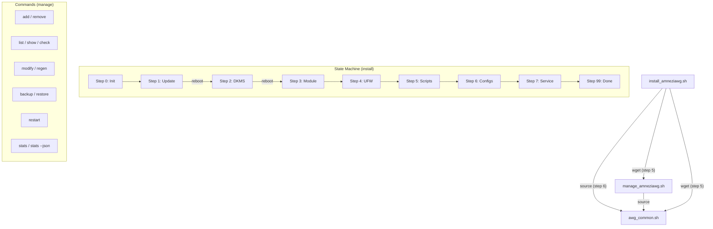

<p align="center">
  <b>RU</b> <a href="ADVANCED.md">Русский</a> | <b>EN</b> English
</p>

# AmneziaWG 2.0 Installer: Advanced Documentation

This is a supplement to the main [README.en.md](README.en.md), containing deeper technical details, explanations, and advanced options for the AmneziaWG 2.0 installation and management scripts. For a step-by-step VPS deployment guide (VPS choice, OS choice, install flow, first client, update, uninstall, troubleshooting), see [INSTALL_VPS.md](INSTALL_VPS.md).

## Table of Contents

<a id="toc-adv"></a>
- [✨ Features (Detailed)](#features-detailed-adv)
- [🔐 AWG 2.0 Parameters](#awg2-params-adv)
  - [Presets (v5.10.0+)](#presets-adv)
- [⚙️ Client Configuration Details](#config-details-adv)
  - [AllowedIPs](#allowedips-adv)
  - [Client Isolation](#client-isolation-adv)
  - [IPv6 Dual-Stack Tunnel (v5.15.0+)](#ipv6-tunnel-adv)
  - [PersistentKeepalive](#persistentkeepalive-adv)
  - [DNS](#dns-adv)
  - [Changing Default Settings](#change-defaults-adv)
- [🔒 Server Security Settings](#security-adv)
  - [UFW Firewall](#ufw-adv)
  - [Kernel Parameters (Sysctl)](#sysctl-adv)
  - [Fail2Ban (Automatic Setup)](#fail2ban-adv)
- [🧹 Server Optimization](#optimization-adv)
- [📋 Configuration Examples](#config-examples-adv)
- [⚙️ CLI Parameters](#cli-params-adv)
  - [install_amneziawg.sh](#install-cli-adv)
  - [manage_amneziawg.sh](#manage-cli-adv)
- [🧑‍💻 Full List of Management Commands](#manage-commands-adv)
- [🛠️ Technical Details](#tech-details-adv)
  - [Script Architecture](#architecture-adv)
  - [DKMS](#dkms-adv)
  - [Key and Config Generation](#keygen-adv)
- [🔄 How to Update Scripts](#update-scripts-adv)
- [❓ FAQ (Additional Questions)](#faq-advanced-adv)
- [🩺 Diagnostics and Uninstall](#diag-uninstall-adv)
  - [Diagnostic Report Contents](#diagnostic-report-adv)
- [🔧 Troubleshooting (Detailed)](#troubleshooting-adv)
- [📊 Traffic Statistics (stats)](#stats-adv)
- [⏳ Temporary Clients (--expires)](#expires-adv)
- [📱 vpn:// URI Import](#vpnuri-adv)
- [📱 MTU and Mobile Clients](#mtu-mobile-adv)
- [🚧 Host Unreachable from Russia (Hetzner): AS-based Blocking](#as-blocking-adv)
- [🛡️ Active Probing and Obfuscation Without a Proxy](#active-probing-adv)
- [📋 AWG 2.0 Client Compatibility](#client-compat-adv)
- [🐧 Debian Support](#debian-support-adv)
- [🔧 Raspberry Pi and ARM64 Support](#arm-support-adv)
- [🐧 Connecting a Linux machine as a client](#linux-client-adv)
- [📦 LXC / Docker via amneziawg-go (userspace)](#lxc-userspace-adv)
- [⚠️ Known Limitations](#limitations-adv)
- [🤝 Contributing](#contributing-adv)
- [💖 Acknowledgements](#thanks-adv)

---

> For the full version history, see [CHANGELOG.en.md](CHANGELOG.en.md).

---

<a id="features-detailed-adv"></a>
## ✨ Features (Detailed)

* **AmneziaWG 2.0:** Support for the next-generation protocol with extended obfuscation parameters (H1-H4 ranges, S3-S4, CPS I1).
* **Native key generation:** Keys are generated via `awg genkey/pubkey`, configs via Bash templates, QR codes via `qrencode`. The external Python/awgcfg.py dependency has been completely removed.
* **Automated installation:** Installs AmneziaWG, DKMS module, dependencies, configures networking, firewall, and sysctl.
* **Resume after reboot:** Uses a state file (`/root/awg/setup_state`) to continue after required reboots.
* **Automated system optimization:**
    * Removal of unnecessary packages (snapd, modemmanager, etc.)
    * Hardware-aware swap and network buffer tuning
    * NIC offload disabling (GRO/GSO/TSO) for VPN optimization
* **Secure by default:**
    * `UFW`: Policy `deny incoming`, SSH rate-limiting, VPN port allowed.
    * `IPv6`: Disabled by default via `sysctl` (optional).
    * `File permissions`: Strict permissions (600/700) on all keys and configs.
    * `Sysctl`: BBR congestion control, anti-spoofing, TCP optimization.
    * `Fail2Ban`: Automatic installation and SSH protection.
* **Backup:** `backup` command in the management script (including client keys).

---

<a id="awg2-params-adv"></a>
## 🔐 AWG 2.0 Parameters

All parameters are generated automatically during installation and saved to `/root/awg/awgsetup_cfg.init`. They are identical for the server and all clients.

| Parameter | Description | Range | Example |
|-----------|-------------|-------|---------|
| `Jc` | Number of junk packets | 3-6 | `5` |
| `Jmin` | Min junk size (bytes) | 40-89 | `55` |
| `Jmax` | Max junk size (bytes) | Jmin+50..Jmin+250 | `200` |
| `S1` | Init message padding (bytes) | 15-150 | `72` |
| `S2` | Response message padding (bytes) | 15-150, S1+56≠S2 | `56` |
| `S3` | Cookie message padding (bytes) | 8-55 | `32` |
| `S4` | Data message padding (bytes) | 4-27 | `16` |
| `H1` | Init message identifier | uint32 range | `134567-245678` |
| `H2` | Response message identifier | uint32 range | `3456789-4567890` |
| `H3` | Cookie message identifier | uint32 range | `56789012-67890123` |
| `H4` | Data message identifier | uint32 range | `456789012-567890123` |
| `I1` | CPS concealment packet | Format `<r N>` | `<r 128>` |
| `I2`-`I5` | Extra CPS / special-junk packets, optional (carried to clients since v5.18.0) | Tags `<r N>` / `<b 0xHEX>` / `<c>` / `<t>` | `<b 0xf1>` |

**Critical constraints:**
* H1-H4 ranges **must not overlap** (guaranteed by the generation algorithm).
* `S1 + 56 ≠ S2` — prevents init and response messages from having the same size.
* All nodes (server + clients) **must** use identical parameters.

> `I1`-`I5` (CPS) disguise the handshake as another protocol - the basis of resistance to active probing. Details: [Active Probing and Obfuscation Without a Proxy](#active-probing-adv).

<a id="presets-adv"></a>
### Presets (v5.10.0+)

Presets are ready-made obfuscation parameter profiles optimized for specific network conditions. Selected during installation via the `--preset` flag.

| Preset | Jc | Jmin | Jmax | When to use |
|--------|-----|------|------|------------|
| `default` | 3-6 (random) | 40-89 | Jmin + 50..250 | Home/wired internet, standard VPS |
| `mobile` | **3** (fixed) | 30-50 | Jmin + 20..80 | Mobile carriers (Tele2, Yota, Megafon, Tattelecom) |

**Installation with a preset:**

```bash
# Standard profile (default)
sudo bash install_amneziawg_en.sh --yes --route-amnezia

# Mobile profile — for SIM cards, LTE/5G modems, mobile routers
sudo bash install_amneziawg_en.sh --preset=mobile --yes --route-amnezia
```

> **Note:** `install_amneziawg_en.sh` and `install_amneziawg.sh` are functionally identical — only the output language differs.

**Fine-grained overrides (`--jc`, `--jmin`, `--jmax`):**

Individual parameters can be overridden on top of any preset:

```bash
# Mobile preset, but Jc=4 instead of 3
sudo bash install_amneziawg_en.sh --preset=mobile --jc=4 --yes --route-amnezia

# Fully manual parameters
sudo bash install_amneziawg_en.sh --jc=2 --jmin=20 --jmax=60 --yes --route-amnezia
```

| Flag | Range | Description |
|------|-------|------------|
| `--jc=N` | 1-128 | Number of junk packets |
| `--jmin=N` | 0-1280 | Minimum junk size (bytes) |
| `--jmax=N` | 0-1280 | Maximum junk size (bytes), must be ≥ Jmin |

> **Tip:** If VPN works on home Wi-Fi but is unstable on mobile data — reinstall with `--preset=mobile`. More about mobile carrier issues in the <a href="#faq-advanced-adv">FAQ</a>.

---

<a id="config-details-adv"></a>
## ⚙️ Client Configuration Details

<a id="allowedips-adv"></a>
### AllowedIPs

Defines which traffic the **client** routes through the VPN tunnel.

1.  **Mode 1: All traffic (`0.0.0.0/0`)**
    * All client IPv4 traffic → VPN.
    * Maximum privacy. May block LAN access.

2.  **Mode 2: Amnezia List + DNS (Default)**
    * List of public IP ranges + DNS `1.1.1.1`, `8.8.8.8`.
    * **Purpose:** DPI bypass, DNS tunneling. Recommended.

3.  **Mode 3: Custom (Split-Tunneling)**
    * Only traffic to specified networks → VPN.
    * Example: `192.168.1.0/24,10.50.0.0/16`

**AllowedIPs Calculator:** [WireGuard AllowedIPs Calculator](https://www.procustodibus.com/blog/2021/03/wireguard-allowedips-calculator/).

<a id="client-isolation-adv"></a>
### Client Isolation

By default VPN clients cannot see each other: the server adds a rule to `PostUp`/`PostDown` in the `awg0.conf` config, `iptables -I FORWARD -i awg0 -o awg0 -j DROP` (plus a symmetric `ip6tables` rule if the IPv6 tunnel is enabled) - it cuts traffic between peers before the general `ACCEPT`, regardless of the routing mode. Before this setting, isolation was an accidental side effect of the mode: split modes (2/3) isolated clients only because their `AllowedIPs` had no route to their neighbors, `--route-all` did not isolate at all, and dual-stack clients in split modes remained reachable to each other over the tunnel's IPv6 subnet.

**Disabling it:** the `--isolation=off` flag at install time (or answering `n` to the interactive question "Isolate VPN clients from each other?" on first run without `--yes`). The DROP rule is not added, and the tunnel subnet is appended to clients' `AllowedIPs` (modes 2/3 - mode 1 with `0.0.0.0/0` already covers it), so devices can see each other inside the VPN.

**Switching it on an already installed server:**

```bash
sudo bash ./install_amneziawg_en.sh --force --isolation=off   # or --isolation=on
```

The setting is persisted in `awgsetup_cfg.init` (the `CLIENT_ISOLATION` key). Just like a routing-mode change, changing isolation via reinstall does not touch already-issued client configs - they need an explicit reissue: `sudo bash /root/awg/manage_amneziawg.sh regen --reset-routes` (the installer prints this hint after a reinstall that changes the mode).

**Legacy configs.** A config without the `CLIENT_ISOLATION` key (created before this setting existed) is treated as isolated (`1`) - that is the previous default behavior of split modes, so there is no surprise on a reinstall without `--isolation`.

<a id="ipv6-tunnel-adv"></a>
### IPv6 Dual-Stack Tunnel (v5.15.0+)

By default the tunnel carries IPv4 only. Starting with v5.15.0 you can also enable IPv6 inside the tunnel - clients get an IPv6 address next to IPv4 (dual-stack).

> **IPv6 in the default IPv4-only mode.** When the tunnel is IPv4-only, your device's IPv6 traffic goes out directly, outside the VPN - by design: an IPv4-only tunnel does not carry IPv6, and the server has no say in it (this is a property of the mode, not a server-side leak). If you want IPv6 inside the tunnel, enable `--allow-ipv6-tunnel` (below). If instead you want a guarantee that nothing goes outside the VPN, turn IPv6 off on the device itself: a server-side filter does not help here, because that direct IPv6 traffic never reaches the server.

**When it activates:** only with the explicit `--allow-ipv6-tunnel` flag on `install_amneziawg.sh`. Without the flag the behavior is identical to earlier versions. This is separate from `--allow-ipv6` / `--disallow-ipv6`, which control host-level IPv6 (sysctl) and are unchanged.

**Interaction with `--disallow-ipv6`.** In-tunnel IPv6 needs host IPv6 forwarding, so if you combine `--allow-ipv6-tunnel` with `--disallow-ipv6` the tunnel flag wins: the installer logs a warning and keeps host IPv6 forwarding enabled. This does not happen silently.

**IPv6 routing mirrors the chosen IPv4 mode (intent-mirroring).** When `--allow-ipv6-tunnel` is enabled, the client's IPv6 `AllowedIPs` mirror the IPv4 mode:

- **Full tunnel** (IPv4 `AllowedIPs` = `0.0.0.0/0`): with native IPv6 on the server the client gets `0.0.0.0/0, ::/0` - all IPv6 traffic goes out to the internet through the VPN; without native IPv6 the client gets `0.0.0.0/0, fddd:2c4:2c4:2c4::/64` - IPv6 only works peer-to-peer inside the tunnel.
- **Split-tunnel** (custom list via `--route-custom`): the IPv4 list is kept unchanged and ONLY the tunnel ULA subnet `fddd:2c4:2c4:2c4::/64` is added. `::/0` is never added - capturing all IPv6 in split mode would break split routing. IPv6 in a split tunnel reaches other peers but not the internet.

> Historical note: in v5.15.0 dual-stack always implied a full tunnel (split-tunnel with IPv6 behaved differently). Since v5.15.1 split-tunnel and IPv6 combine correctly per the rules above. If a client was created on v5.15.0, recreate it (`manage remove` + `add`) to get the corrected `AllowedIPs`.

**Subnet:** the private ULA `fddd:2c4:2c4:2c4::/64`. The server takes `::1`, clients get `::2`, `::3`, and so on, mirroring the IPv4 numbering. The subnet can be overridden before the first run via `IPV6_SUBNET=` in `/root/awg/awgsetup_cfg.init`.

**How native IPv6 is detected on the server.** The script considers the server to have internet-routable IPv6 only when BOTH conditions hold:

1. a global IPv6 address outside the ULA range (`fc00::/7`, i.e. not `fddd:...`) - checked via `ip -6 addr show scope global`;
2. a default IPv6 route - checked via `ip -6 route show default`.

A ULA address has scope global on its own but is not routed to the internet, so an address alone is not enough - a default route is also required. If either condition is missing, the server is treated as having no native IPv6: the client gets the tunnel ULA instead of `::/0` (per the routing rules above) and a warning is logged. The tunnel stays fully functional over IPv4.

**How to add it to an existing install.** Re-run the installer with `--force` and the tunnel flag:

```bash
sudo bash ./install_amneziawg_en.sh --force --allow-ipv6-tunnel
# RU version: sudo bash ./install_amneziawg.sh --force --allow-ipv6-tunnel
```

`--force` is required: without it a run on an already-working server aborts at the idempotency guard and the flag is ignored. It is `--force` that re-renders the server config as dual-stack (`[Interface] Address`, sysctl, PostUp with ip6tables). Without it an existing install is left unchanged and the server never gets its IPv6. Just setting `ALLOW_IPV6_TUNNEL=1` in `/root/awg/awgsetup_cfg.init` is not enough on its own - it does not re-render the server config.

Already-issued IPv4-only clients are not changed by this. To give IPv6 to such a client, recreate it - only recreation allocates an IPv6 for that client on the server:

```bash
sudo bash /root/awg/manage_amneziawg.sh remove <name>
sudo bash /root/awg/manage_amneziawg.sh add <name>
```

Then re-import the new `.conf` on the device. A plain `regen` will not help here: it mirrors the addresses from the client's `[Peer]` entry on the server, and an old client has no IPv6 there yet, so the config stays IPv4-only. `manage list` correctly shows the mixed state (dual-stack next to IPv4-only).

**Troubleshooting:**

- **ULA subnet collision.** If `fddd:2c4:2c4:2c4::/64` is already used in your network, set a different ULA subnet via `IPV6_SUBNET=` before installing.
- **IPv6 not routing to the internet.** Check both signs of native IPv6: a global address outside ULA (`ip -6 addr show scope global`) AND a default route (`ip -6 route show default`). If either is missing, IPv6 internet egress is not possible - this is expected, and the tunnel works over IPv4. If both are present, check the ip6tables MASQUERADE rule and forwarding (`sysctl net.ipv6.conf.all.forwarding`).
- **Rollback / IPv6 cleanup.** Setting `ALLOW_IPV6_TUNNEL=0` does not remove dual-stack `AllowedIPs` entries already added to `awg0.conf`. For a full cleanup: `awg-quick down awg0; sed -i 's|, fddd:[^/]*/[0-9]*||g' /etc/amnezia/amneziawg/awg0.conf; awg-quick up awg0`.

<a id="persistentkeepalive-adv"></a>
### PersistentKeepalive

* **Default value:** `33` seconds.
* Maintains the UDP session through NAT.
* **Change:** `sudo bash /root/awg/manage_amneziawg.sh modify <name> PersistentKeepalive 25`

<a id="dns-adv"></a>
### DNS

* **Default value:** `1.1.1.1, 1.0.0.1` (Cloudflare, primary + fallback).
* DNS server for the client inside the VPN.
* **Change:** `sudo bash /root/awg/manage_amneziawg.sh modify <name> DNS "8.8.8.8,1.0.0.1"`

<a id="change-defaults-adv"></a>
### Changing Default Settings

To change the default DNS or PersistentKeepalive for **new** clients, edit the `render_client_config()` function in `awg_common.sh` **before** the first run.

---

<a id="security-adv"></a>
## 🔒 Server Security Settings

<a id="ufw-adv"></a>
### UFW Firewall

* **Policies:** Deny incoming, Allow outgoing, Deny routed.
* **Rules:** `limit 22/tcp` (SSH), `allow <vpn_port>/udp`, `route allow in on awg0 out on <nic>` (VPN traffic forwarding, added in v5.7.6).
* **Check:** `sudo ufw status verbose`

<a id="sysctl-adv"></a>
### Kernel Parameters (Sysctl)

File: `/etc/sysctl.d/99-amneziawg-security.conf`. Includes:
* IP forwarding
* IPv6 disable (optional)
* BBR congestion control + FQ qdisc
* TCP hardening (syncookies, rp_filter, RFC1337)
* ICMP redirects and source routing disabled
* Adaptive network buffers (rmem/wmem based on RAM)
* nf_conntrack_max = 65536
* kernel.sysrq = 0

<a id="fail2ban-adv"></a>
### Fail2Ban (Automatic Setup)

* Automatically installed and configured for SSH protection.
* **Settings:** Ban via `ufw`, 5 attempts → 1-hour ban.
* **Debian:** Automatically uses `backend = systemd` (journald). Ubuntu uses `backend = auto`.
* **Check:** `sudo fail2ban-client status sshd`.

#### Safe Configuration Loading (v5.7.2)

Starting with v5.7.2, the `awgsetup_cfg.init` parameters file is loaded via `safe_load_config()` — a whitelist parser that only accepts predefined keys (`AWG_*`, `OS_*`, `DISABLE_IPV6`, `ALLOWED_IPS_*`, `NO_TWEAKS`, etc.). The previous `source` method has been completely replaced. The parser correctly handles values in both single and double quotes (`'value'` or `"value"`).

This protects against potential code injection: even if the configuration file is modified, arbitrary commands will not execute.

---

<a id="optimization-adv"></a>
## 🧹 Server Optimization

The installer automatically optimizes the server:

**Removed packages:** `snapd`, `modemmanager`, `networkd-dispatcher`, `unattended-upgrades`, `packagekit`, `lxd-agent-loader`, `udisks2`. Cloud-init is removed **only** if it does not manage network configuration.

**Hardware-aware settings:**
* **Swap:** 1 GB if RAM ≤ 2 GB, 512 MB if RAM > 2 GB. `vm.swappiness = 10`.
* **NIC:** GRO/GSO/TSO offloads disabled (can interfere with VPN traffic).
* **Network buffers:** Automatic `rmem_max`/`wmem_max` tuning based on available RAM.

---

<a id="config-examples-adv"></a>
## 📋 Configuration Examples

<details>
<summary><strong>awgsetup_cfg.init (installation parameters)</strong></summary>

```bash
# AmneziaWG 2.0 installation configuration (auto-generated)
export AWG_PORT=39743
export AWG_TUNNEL_SUBNET='10.9.9.1/24'
export DISABLE_IPV6=1
export ALLOWED_IPS_MODE=2
export ALLOWED_IPS='1.0.0.0/8, 2.0.0.0/7, 4.0.0.0/6, 8.0.0.0/7, ...'
export AWG_ENDPOINT=''
export AWG_Jc=6
export AWG_Jmin=55
export AWG_Jmax=205
export AWG_S1=72
export AWG_S2=56
export AWG_S3=32
export AWG_S4=16
export AWG_H1='234567-345678'
export AWG_H2='3456789-4567890'
export AWG_H3='56789012-67890123'
export AWG_H4='456789012-567890123'
export AWG_I1='<r 128>'
export AWG_PRESET='default'
```
</details>

<details>
<summary><strong>awg0.conf (server config, keys masked)</strong></summary>

```ini
[Interface]
PrivateKey = [SERVER_PRIVATE_KEY]
Address = 10.9.9.1/24
MTU = 1280
ListenPort = 39743
PostUp = iptables -I FORWARD -i %i -j ACCEPT; iptables -t nat -A POSTROUTING -o eth0 -j MASQUERADE
PostDown = iptables -D FORWARD -i %i -j ACCEPT; iptables -t nat -D POSTROUTING -o eth0 -j MASQUERADE
Jc = 6
Jmin = 55
Jmax = 205
S1 = 72
S2 = 56
S3 = 32
S4 = 16
H1 = 234567-345678
H2 = 3456789-4567890
H3 = 56789012-67890123
H4 = 456789012-567890123
I1 = <r 128>

[Peer]
#_Name = my_phone
PublicKey = [CLIENT_PUBLIC_KEY]
AllowedIPs = 10.9.9.2/32
```
</details>

<details>
<summary><strong>Minimal awg0.conf for AWG 2.0 (for manual setup)</strong></summary>

If you are setting up the server without my installer (for example, `amneziawg-go` in LXC), the minimum valid `awg0.conf` for AWG 2.0 looks like this — all 11 obfuscation parameters are required; `manage_amneziawg.sh add/regen` will abort if any one of them is missing:

```ini
[Interface]
PrivateKey = [SERVER_PRIVATE_KEY]
Address = 10.9.9.1/24
ListenPort = 51820
Jc = 4
Jmin = 40
Jmax = 90
S1 = 50
S2 = 40
S3 = 12
S4 = 8
H1 = 1234567
H2 = 2345678
H3 = 3456789
H4 = 4567890
```

Notes for manual setups:

- **S3/S4** are AWG 2.0 parameters added to the protocol later than S1/S2. Configs from the earlier AWG 1.x release may not have them - add by hand, `S3` takes `0-64` and `S4` takes `0-32`, the key point is that the keys exist at all.
- **H1–H4** can be single-value (`H1 = 1234567`) or a range (`H1 = 100000-200000`); ranges must not overlap. Keep the upper bound at `2147483647` (`INT32_MAX`) or below, otherwise `amneziawg-windows-client` may flag the value as invalid.
- **I1-I5** (CPS / special-junk packets) are optional. Without `I1` the AWG client falls back to AWG 1.0 mode; for full AWG 2.0 obfuscation add `I1 = <r 128>` (random 128 bytes) or `I1 = <b 0xHEX>` (binary). Since v5.18.0 all five (`I1`-`I5`) are carried into client configs, not just `I1`: set `I2`-`I5` in the `[Interface]` section of `awg0.conf`, restart the service (`sudo systemctl restart awg-quick@awg0`), and distribute to clients with `sudo bash /root/awg/manage_amneziawg.sh regen <name>` - the values flow into the `.conf`, QR, and `vpn://`. Ready-made sets come from, e.g., the VoidWaifu list; tag formats: `<r N>`, `<b 0xHEX>`, `<c>`, `<t>`. The values must match on server and clients. Unset `I2`-`I5` are simply not emitted.
- **MTU**, **PostUp/PostDown** are optional and depend on the setup (see the `amneziawg-go` LXC section on `iptables` MASQUERADE).

After creating such an `awg0.conf`, `manage_amneziawg.sh` also needs `/root/awg/server_public.key` (compute it with `awg pubkey < /etc/amnezia/amneziawg/server_private.key > /root/awg/server_public.key`) and a minimal `/root/awg/awgsetup_cfg.init` containing at least `AWG_PORT`, `AWG_TUNNEL_SUBNET`, `AWG_ENDPOINT`.

</details>

<details>
<summary><strong>client.conf (client config, keys masked)</strong></summary>

```ini
[Interface]
PrivateKey = [CLIENT_PRIVATE_KEY]
Address = 10.9.9.2/32
DNS = 1.1.1.1
MTU = 1280
Jc = 6
Jmin = 55
Jmax = 205
S1 = 72
S2 = 56
S3 = 32
S4 = 16
H1 = 234567-345678
H2 = 3456789-4567890
H3 = 56789012-67890123
H4 = 456789012-567890123
I1 = <r 128>

[Peer]
PublicKey = [SERVER_PUBLIC_KEY]
Endpoint = 203.0.113.1:39743
AllowedIPs = 1.0.0.0/8, 2.0.0.0/7, 4.0.0.0/6, 8.0.0.0/7, ...
PersistentKeepalive = 33
```
</details>

---

<a id="cli-params-adv"></a>
## 🖥️ CLI Parameters

<a id="install-cli-adv"></a>
### install_amneziawg.sh

```
Options:
  -h, --help            Show help
  --uninstall           Uninstall AmneziaWG
  --diagnostic          Generate diagnostic report
  -v, --verbose         Verbose output (including DEBUG)
  --no-color            Disable colored output
  --port=PORT           Set UDP port (1024-65535)
  --ssh-port=PORT       SSH port for the UFW rule (auto-detected; comma-separated list)
  --subnet=SUBNET       Tunnel subnet, CIDR /16-/30 (e.g. 10.9.0.0/16)
  --allow-ipv6          Keep IPv6 enabled
  --disallow-ipv6       Force-disable IPv6
  --allow-ipv6-tunnel   Enable dual-stack IPv6 inside the tunnel (ULA, opt-in)
  --route-all           Mode: All traffic (0.0.0.0/0)
  --route-amnezia       Mode: Amnezia List + DNS (default)
  --route-custom=NETS   Mode: Only specified networks
  --isolation=on|off    Isolate clients from each other (default on)
  --endpoint=ADDR       External server endpoint: FQDN, IPv4 or [IPv6] (NAT)
  --preset=TYPE         Obfuscation parameter preset: default, mobile
                        mobile: Jc=3, narrow Jmax — for mobile carriers (Tele2, Yota, Megafon)
  --jc=N                Set Jc manually (1-128, overrides preset)
  --jmin=N              Set Jmin manually (0-1280, overrides preset)
  --jmax=N              Set Jmax manually (0-1280, overrides preset, must be >= Jmin)
  -y, --yes             Non-interactive mode (all confirmations auto-yes)
  -f, --force           Reinstall over a working AWG (ENV: AWG_FORCE_REINSTALL=1)
  --no-tweaks           Skip optional hardening/optimization (UFW, Fail2Ban);
                        the minimal forwarding sysctl is always applied
```

<a id="manage-cli-adv"></a>
### manage_amneziawg.sh

```
Options:
  -h, --help            Show help
  -v, --verbose         Verbose output (for list)
  --no-color            Disable colored output
  --conf-dir=PATH       Specify AWG directory (default: /root/awg)
  --server-conf=PATH    Specify server config file
  --json                JSON output (for list / stats; list includes client_ipv6)
  --expires=DURATION    Expiry duration for add (1h, 12h, 1d, 7d, 30d, 4w)
  --apply-mode=MODE     syncconf (default) or restart (bypass kernel panic)
  --psk                 (add only) generate a PresharedKey for the new client (v5.11.1+)
  --yes                 Do not prompt for confirmation (ENV: AWG_YES=1)
  --carrier=NAME        (diagnose only) compare parameters against a carrier profile
```

> **`--psk`** — optional extra layer on top of AWG 2.0 obfuscation. Generates a 32-byte symmetric key via `awg genpsk` and writes it to both the server `[Peer]` and the client `[Peer]` (`PresharedKey = ...`). Compatible with any WireGuard/AmneziaWG client. In batch mode (`add c1 c2 c3 --psk`) each client gets its own PSK. Without the flag clients are created without `PresharedKey` (default — AWG 2.0 obfuscation is sufficient for most scenarios). The flag only affects the new clients created by this `add` invocation — existing clients without PSK stay untouched and keep connecting as before.

**Environment variables:**

| Variable | Description |
|----------|-------------|
| `AWG_SKIP_APPLY=1` | Skip apply_config. For automation: accumulate N operations, apply once |
| `AWG_APPLY_MODE=restart` | Full restart instead of syncconf (can be saved in `awgsetup_cfg.init`) |
| `AWG_YES=1` | Do not prompt for confirmation (equivalent to the `--yes` flag) |

---

<a id="manage-commands-adv"></a>
## 🧑‍💻 Full List of Management Commands

Usage: `sudo bash /root/awg/manage_amneziawg.sh <command>`:

> **How `manage` finds clients in the server config.** Every `[Peer]` created by my installer or by `manage add` has a marker comment `#_Name = <name>` on the first line of the block. That marker is what `list`, `remove`, `regen`, `modify` look up. If you are migrating `awg0.conf` from an older server or adding a peer by hand, include `#_Name = <name>` right after `[Peer]` — otherwise `manage` will not see the client. Example: the `[Peer]` block in the server config above (see [Configuration Examples](#config-examples-adv)).

* **`add <name> [name2 ...] [--expires=DURATION] [--psk]`:** Add one or multiple clients. In batch mode, `awg syncconf` is called once for all. With `--expires` — expiry applies to all clients. With `--psk` — each client gets its own PresharedKey (v5.11.1+).
* **`remove <name> [name2 ...]`:** Remove one or multiple clients. In batch mode, apply_config is called once for all.
* **`list [-v] [--json]`:** List clients (with details when using `-v`; `--json` - machine-readable, includes the `client_ipv6` field).
* **`regen [name] [--reset-routes]`:** Regenerate `.conf`/`.png` files for one or all clients. By default preserves the client's individual `AllowedIPs`/`DNS`/`PersistentKeepalive` (set via `modify`). With `--reset-routes` - resets `AllowedIPs` to the current global routing mode from `awgsetup_cfg.init`; use it after changing the mode via reinstall (`--force --route-all` / `--route-amnezia` / `--route-custom=`) so the new mode reaches existing clients (Issue #170).
* **`modify <name> <param> <value>`:** Modify a client parameter in the `.conf` file. Allowed parameters: DNS, Endpoint, AllowedIPs, PersistentKeepalive. QR code and vpn:// URI are automatically regenerated after modification.
* **`backup`:** Create a backup (configs + keys + client expiry data + cron).
* **`restore [file]`:** Restore from a backup (including expiry data and cron job).
* **`check` / `status`:** Check server status (service, port, AWG 2.0 parameters).
* **`show`:** Run `awg show`.
* **`restart`:** Restart the AmneziaWG service.
* **`diagnose [--carrier=NAME]`:** Self-troubleshooting: checks the kernel module, sysctl and UFW; with `--carrier` it compares AWG parameters against a mobile carrier profile.
* **`repair-module`:** Rebuild/restore the amneziawg kernel module (DKMS) after a server kernel upgrade.
* **`help`:** Show help.
* **`stats [--json]`:** Per-client traffic statistics. With `--json` — machine-readable format for integration.

### Usage Examples

```bash
# Change client DNS
sudo bash /root/awg/manage_amneziawg.sh modify my_phone DNS "8.8.8.8,1.0.0.1"

# Change PersistentKeepalive
sudo bash /root/awg/manage_amneziawg.sh modify my_phone PersistentKeepalive 25

# Change AllowedIPs (split-tunneling)
sudo bash /root/awg/manage_amneziawg.sh modify my_phone AllowedIPs "192.168.1.0/24,10.0.0.0/8"

# Regenerate config for a single client
sudo bash /root/awg/manage_amneziawg.sh regen my_phone

# Create a backup
sudo bash /root/awg/manage_amneziawg.sh backup

# Restore from the latest backup (interactive selection)
sudo bash /root/awg/manage_amneziawg.sh restore
```

---

<a id="tech-details-adv"></a>
## 🛠️ Technical Details

<a id="architecture-adv"></a>
### Script Architecture

| File | Purpose |
|------|---------|
| `install_amneziawg.sh` | Installer: 8-step state machine with resume support |
| `manage_amneziawg.sh` | Management: add/remove/list/regen/stats/backup/restore |
| `awg_common.sh` | Shared library: keys, configs, QR, peer management |
| `install_amneziawg_en.sh` | Installer (English version) |
| `manage_amneziawg_en.sh` | Management (English version) |
| `awg_common_en.sh` | Shared library (English version) |

`awg_common.sh` is loaded via `source` from both scripts. The installer downloads it at step 5.



<a id="dkms-adv"></a>
### DKMS

Automatic rebuilding of the `amneziawg` kernel module on kernel updates. Check: `dkms status`.

<a id="keygen-adv"></a>
### Key and Config Generation

**Fully native** generation:
* **Keys:** `awg genkey` + `awg pubkey` (standard AmneziaWG utilities).
* **Configs:** Bash templates with AWG 2.0 parameters.
* **QR codes:** `qrencode -t png`.
* **Python/awgcfg.py:** Completely removed. The config deletion bug workaround is no longer needed.

Client keys are stored in `/root/awg/keys/` (permissions 600). Server keys are in `/root/awg/server_private.key` and `server_public.key`.

#### Version-Pinned URLs (v5.7.2)

The installer downloads `awg_common.sh` and `manage_amneziawg.sh` from URLs pinned to the specific version tag:

```
https://raw.githubusercontent.com/bivlked/amneziawg-installer/v5.19.2/awg_common.sh
```

This provides **supply chain pinning**: downloaded scripts match the installer version, even if `main` has already been updated.

For development, you can override the branch:

```bash
AWG_BRANCH=my-feature-branch sudo bash ./install_amneziawg_en.sh
```

---

<a id="update-scripts-adv"></a>
## 🔄 How to Update Scripts

To update the management and shared library scripts **without reinstalling the server**:

```bash
# Russian version:
wget -O /root/awg/manage_amneziawg.sh https://raw.githubusercontent.com/bivlked/amneziawg-installer/v5.19.2/manage_amneziawg.sh
wget -O /root/awg/awg_common.sh https://raw.githubusercontent.com/bivlked/amneziawg-installer/v5.19.2/awg_common.sh

# English version:
wget -O /root/awg/manage_amneziawg.sh https://raw.githubusercontent.com/bivlked/amneziawg-installer/v5.19.2/manage_amneziawg_en.sh
wget -O /root/awg/awg_common.sh https://raw.githubusercontent.com/bivlked/amneziawg-installer/v5.19.2/awg_common_en.sh

# Set permissions
chmod 700 /root/awg/manage_amneziawg.sh /root/awg/awg_common.sh
```

> **Note:** Reinstalling `install_amneziawg.sh` is **not required** for management updates. A reinstallation is only necessary when switching protocol versions.

---

<a id="faq-advanced-adv"></a>
## ❓ FAQ (Additional Questions)

<details>
  <summary><strong>Q: How do I get a split exit - Russian traffic direct, the rest abroad?</strong></summary>
  <b>A:</b> This is built as a two-server cascade: the client connects to an entry server (ideally in Russia), Russian traffic exits directly from it, and everything else goes through a second server abroad. The cascade is not part of the installer (different scale), but there is a separate step-by-step guide - <a href="CASCADE.en.md">CASCADE.en.md</a>.
</details>

<details>
  <summary><strong>Q: AmneziaVPN says "this server does not support split tunneling". How do I enable it?</strong></summary>
  <b>A:</b> This is a limitation of the client, not the server. The AmneziaVPN app's built-in split tunneling by sites and apps only turns on when the config sends all traffic through the tunnel. The client looks at <code>AllowedIPs</code>: a full tunnel unlocks the feature, while a partial subnet list is treated as already split at the routing level, so the client hides its toggle with that message. The full-tunnel form it reliably recognizes is the pair <code>0.0.0.0/0, ::/0</code>. The "Amnezia" routing mode (the default) produces a subnet list, which is why the feature is unavailable. Fix, no docker needed: switch the client to a full tunnel - replace the line in its <code>.conf</code> with <code>AllowedIPs = 0.0.0.0/0, ::/0</code> and re-import, or re-issue the client in "All traffic" mode (<code>--route-all</code>). The split tunneling page in the app then opens and you pick sites/apps there. If you only need part of the traffic in the tunnel (a network-level split), <code>AllowedIPs</code> already does that - the app feature is not required for it.
</details>

<details>
  <summary><strong>Q: The desktop AmneziaVPN on macOS hangs on connect. What can I do?</strong></summary>
  <b>A:</b> The desktop AmneziaVPN app on macOS does not yet support CPS (the <code>I1</code> parameter) - the newest AmneziaWG 2.0 obfuscation layer, so it hangs on connect. Mobile (iOS/Android) and CLI clients handle CPS and connect fine. Install with the <code>--no-cps</code> flag: the installer drops <code>I1</code> from the server config and all clients, and the desktop connects. Only the CPS layer is lost, the rest of the obfuscation (Jc/S1-S4/H1-H4) stays - which is exactly what worked in Russia before CPS existed. On an already-installed server it is the same via reinstall: <code>sudo bash install_amneziawg_en.sh --force --no-cps</code>, then reissue existing clients <code>sudo bash /root/awg/manage_amneziawg.sh regen</code> (without this a client that still has <code>I1</code> will not match a server without <code>I1</code>). To re-enable CPS later, reinstall with any set-regeneration flag, e.g. <code>--preset=default</code> - note that this regenerates the WHOLE obfuscation set (H1-H4/S1-S4 too), so after re-enabling you need a <code>regen</code> of all clients again. The flag drops only <code>I1</code>: if you added <code>I2</code>-<code>I5</code> manually, they stay in the configs. Issue <a href="https://github.com/bivlked/amneziawg-installer/issues/159">#159</a>.
</details>

<details>
  <summary><strong>Q: How do I change the AmneziaWG port after installation?</strong></summary>
  <b>A:</b> 1. Change <code>ListenPort</code> in <code>/etc/amnezia/amneziawg/awg0.conf</code>. 2. Change <code>AWG_PORT</code> in <code>/root/awg/awgsetup_cfg.init</code>. 3. Update UFW (<code>sudo ufw delete allow &lt;old_port&gt;/udp</code>, <code>sudo ufw allow &lt;new_port&gt;/udp</code>). 4. Restart the service (<code>sudo systemctl restart awg-quick@awg0</code>). 5. <b>Regenerate ALL client configs</b> (<code>sudo bash /root/awg/manage_amneziawg.sh regen</code>) and distribute them.
</details>

<details>
  <summary><strong>Q: How do I change the internal VPN subnet?</strong></summary>
  <b>A:</b> The easiest way is to uninstall (<code>sudo bash ./install_amneziawg_en.sh --uninstall</code>) and reinstall, specifying the new subnet during initial setup. A reinstall over a live server (<code>--force</code>) with a different subnet aborts while clients exist in the config - their addresses were issued in the old subnet.
</details>

<details>
  <summary><strong>Q: How do I change the MTU?</strong></summary>
  <b>A:</b> Starting with v5.7.4, <code>MTU = 1280</code> is set automatically. To change it: edit the <code>MTU = &lt;value&gt;</code> line in the <code>[Interface]</code> section of <code>/etc/amnezia/amneziawg/awg0.conf</code> and in client <code>.conf</code> files. Restart the service. See <a href="#mtu-mobile-adv">MTU and Mobile Clients</a> for details.
</details>

<details>
  <summary><strong>Q: Where are the AWG 2.0 parameters stored?</strong></summary>
  <b>A:</b> In <code>/root/awg/awgsetup_cfg.init</code> (variables AWG_Jc, AWG_S1..S4, AWG_H1..H4, AWG_I1..I5). These same parameters are written to the server and client configs.
</details>

<details>
  <summary><strong>Q: Can I change AWG 2.0 parameters after installation?</strong></summary>
  <b>A:</b> Yes. This is useful if your ISP started fingerprinting your server by static obfuscation parameters (e.g. Russian DPI blocked specific H1-H4 ranges). Workflow as of v5.8.0:
  <ol>
    <li>Edit parameters (Jc, S1-S4, H1-H4, I1-I5) in the <code>[Interface]</code> section of <code>/etc/amnezia/amneziawg/awg0.conf</code>.</li>
    <li>Restart the service: <code>sudo systemctl restart awg-quick@awg0</code>.</li>
    <li>Regenerate every client config: <code>sudo bash /root/awg/manage_amneziawg.sh regen &lt;name&gt;</code>. As of v5.8.0, <code>regen</code> reads live values directly from <code>awg0.conf</code> (the source of truth) instead of the cached <code>awgsetup_cfg.init</code>.</li>
    <li>Distribute the new <code>.conf</code> / QR codes / vpn:// URIs to clients.</li>
  </ol>
  <b>Important:</b> server and client parameters must match — otherwise the handshake fails. The easiest way to get a fresh set of randomized non-overlapping H1-H4 ranges is to reinstall the server (<code>--uninstall</code> followed by a fresh install) — every install generates a unique set.
</details>

<details>
  <summary><strong>Q: How is this different from the official Amnezia app?</strong></summary>
  <b>A:</b> The protocol underneath is the same - AmneziaWG 2.0 with the same obfuscation. What differs is how the server is deployed and run. The official Amnezia app is a graphical client: you point it at a server and it installs the server side in Docker containers over SSH, without the host-wide tuning and hardening this installer does. This installer is built to get the most out of a dedicated VPS as a VPN server, so it works differently:
  <ul>
    <li>AmneziaWG runs as a kernel module (DKMS), with no Docker - no background daemon and none of its RAM/CPU cost.</li>
    <li>The whole server is tuned to the hardware: sysctl buffers, swap, NIC offloads, BBR, unneeded packages stripped.</li>
    <li>The attack surface is kept small: UFW deny-all, Fail2Ban, strict permissions, sysctl hardening, one service instead of a stack.</li>
    <li>Fine tuning is available: a mobile-network preset and direct access to the AWG 2.0 parameters.</li>
    <li>Management is from the CLI (<code>manage</code> add/remove/list/<code>--expires</code>), with prebuilt ARM modules and a headless mode for automation.</li>
  </ul>
  A detailed comparison is on the <a href="https://bivlked.github.io/amneziawg-installer/compare/">comparison page</a>.
</details>

<details>
  <summary><strong>Q: My Hetzner server is unreachable from Russia: the handshake completes, then traffic freezes. What do I do?</strong></summary>
  <b>A:</b> The server most likely landed in an AS that is not on Russia's allowlist (Hetzner is <code>AS24940</code>). Ordinary junk does not help; what gets through is an <code>I1</code>/CPS packet disguised as QUIC with an allowlisted SNI (<code>7-zip.org</code> for Hetzner). The method does not work on every ISP. Field results and instructions are in the <a href="#as-blocking-adv">Host Unreachable from Russia</a> section.
</details>

<details>
  <summary><strong>Q: Server behind NAT — how do I specify the external IP?</strong></summary>
  <b>A:</b> Use the <code>--endpoint=&lt;external_IP&gt;</code> flag during installation: <code>sudo bash ./install_amneziawg_en.sh --endpoint=1.2.3.4</code>. Or specify it later via <code>sudo bash /root/awg/manage_amneziawg.sh regen</code> (the script will attempt to detect the IP automatically).
</details>

<details>
  <summary><strong>Q: How do I set up port forwarding (NAT) for AmneziaWG?</strong></summary>
  <b>A:</b> If the server is behind NAT (e.g., in a cloud with a private IP): 1. Forward the AmneziaWG UDP port (default 39743) to the external IP. 2. During installation, specify the external IP: <code>--endpoint=EXTERNAL_IP</code>. 3. Make sure the provider's firewall allows incoming UDP on that port.
</details>

<details>
  <summary><strong>Q: How do I change DNS for all existing clients?</strong></summary>
  <b>A:</b> Use the <code>modify</code> command for each client: <code>sudo bash /root/awg/manage_amneziawg.sh modify &lt;name&gt; DNS "8.8.8.8,1.0.0.1"</code>. Then regenerate configs: <code>sudo bash /root/awg/manage_amneziawg.sh regen</code>. To change the default DNS for new clients, edit <code>awg_common.sh</code>.
</details>

<details>
  <summary><strong>Q: How do I monitor VPN traffic?</strong></summary>
  <b>A:</b> 1. Current connections: <code>sudo awg show</code>. 2. Transfer stats: <code>sudo awg show awg0 transfer</code>. 3. Service logs: <code>sudo journalctl -u awg-quick@awg0 -f</code>. 4. Overall status: <code>sudo bash /root/awg/manage_amneziawg.sh check</code>.
</details>

<details>
  <summary><strong>Q: "Invalid key: s3" error when importing config in the Windows client?</strong></summary>
  <b>A:</b> You're using an outdated version of <code>amneziawg-windows-client</code> (< 2.0.0) that doesn't understand AWG 2.0 parameters. Update to <a href="https://github.com/amnezia-vpn/amneziawg-windows-client/releases"><b>version 2.0.0+</b></a>. Alternatively, use <a href="https://github.com/amnezia-vpn/amnezia-client/releases"><b>Amnezia VPN</b></a> >= 4.8.12.7.
</details>

<details>
  <summary><strong>Q: My AWG 2.0 server can't handshake with my old AWG 1.0 client — why?</strong></summary>
  <b>A:</b> When the server generates <code>S3>0</code> or <code>S4>0</code> (cookie / data padding from AWG 2.0), an AWG 1.0 client cannot handshake with it. This is a <b>known upstream issue</b>: <a href="https://github.com/amnezia-vpn/amneziawg-linux-kernel-module/issues/168">amnezia-vpn/amneziawg-linux-kernel-module#168</a>. My installer always generates <code>S3=8..55</code> and <code>S4=4..27</code> — both <code>>0</code>.
  <br><br>
  <b>In the typical scenario</b> (Amnezia VPN client / WireGuard-Tools 2.0+ on the clients + client <code>.conf</code> files generated by <code>manage add</code>) there is no issue: <code>manage</code> always writes <code>S3</code> / <code>S4</code> into the client <code>.conf</code>. The risk arises <b>only</b> when:
  <ul>
    <li>client <code>.conf</code> files are hand-edited to remove <code>S3</code> / <code>S4</code>;</li>
    <li>the server preset is imported into a WireGuard client without AWG extensions (plain <code>wg-quick</code> on an older kernel without the <code>amneziawg</code> module);</li>
    <li>migrating from an AWG 1.x setup where clients deliberately used <code>S3=0</code> / <code>S4=0</code>.</li>
  </ul>
  <b>Resolution</b>: use an AWG 2.0-aware client (Amnezia VPN >= 4.8.12.7 or amneziawg-windows-client >= 2.0.0) and keep <code>S3</code> / <code>S4</code> in the client <code>.conf</code> identical to the server. A real AWG 1.0 fallback is out of scope for the standard install — track upstream issue #168 for a fix.
</details>

<details>
  <summary><strong>Q: DKMS error after kernel update — what should I do?</strong></summary>
  <b>A:</b> 1. Check status: <code>dkms status</code>. 2. Try rebuilding: <code>sudo dkms install amneziawg/$(dkms status | grep amneziawg | head -1 | awk -F'[,/ ]+' '{print $2}')</code>. 3. Make sure kernel headers are installed: <code>sudo apt install linux-headers-$(uname -r)</code>. 4. If the error persists, run diagnostics: <code>sudo bash ./install_amneziawg_en.sh --diagnostic</code>.
</details>

<details>
  <summary><strong>Q: What changes for me after installing v5.12.0+ when the kernel is upgraded?</strong></summary>
  <b>A:</b> Before v5.12.0, after <code>apt upgrade</code> of the kernel DKMS did not always rebuild the <code>amneziawg</code> module by the next <code>reboot</code>. Symptom: <code>awg-quick@awg0</code> fails with <code>modprobe: FATAL: Module amneziawg not found</code>, and the VPN is down until manual recovery.
  <br><br>
  In v5.12.0 I added three safety nets that work transparently:
  <ol>
    <li><b>apt hook</b> <code>/etc/apt/apt.conf.d/99-amneziawg-post-kernel</code> — after <code>apt upgrade</code> the helper <code>/usr/local/sbin/amneziawg-ensure-module --hook</code> rebuilds DKMS for the new kernel. Log: <code>/var/log/amneziawg-ensure-module.log</code> (weekly rotate, 4 copies).</li>
    <li><b>systemd unit</b> <code>amneziawg-ensure-module.service</code> — at boot, before <code>awg-quick@awg0</code>, the helper iterates kernels with already-installed headers, rebuilds DKMS for the current kernel, runs <code>modprobe amneziawg</code>, and verifies the load via <code>lsmod</code>. If headers are not yet installed, it logs a WARN and exits successfully so it does not block boot. Logs in journal: <code>journalctl -u amneziawg-ensure-module.service</code>.</li>
    <li><b>manage repair-module</b> — explicit fallback: <code>sudo bash /root/awg/manage_amneziawg.sh repair-module</code> installs kernel-headers (with <code>AWG_ALLOW_APT_IN_ENSURE=1</code>), rebuilds DKMS, restarts <code>awg-quick</code>.</li>
  </ol>
  <b>Manual recovery</b> (if none of the three auto paths fired, or you are still on v5.11.x):
  <pre>sudo apt install linux-headers-$(uname -r)
sudo dkms autoinstall
sudo modprobe amneziawg
sudo systemctl restart awg-quick@awg0</pre>
  <b>Limitations</b>:
  <ul>
    <li><b>ARM prebuilt</b> (Raspberry Pi, Hetzner CAX, Oracle Ampere) uses a prebuilt <code>.deb</code> rather than DKMS — auto-repair is not engaged. After a kernel upgrade either rerun the installer (it will pick a fresh prebuilt or fall back to DKMS), or run <code>manage repair-module</code>.</li>
    <li><b>Cloud kernels</b> (Azure / AWS / GCP / Oracle / Debian-cloud) — the installer detects the meta-package from the <code>uname -r</code> suffix (e.g. <code>linux-headers-azure</code>). If you have a custom kernel or an unusual flavor, <code>manage repair-module</code> does the same in reactive mode.</li>
  </ul>
</details>

<details>
  <summary><strong>Q: Detailed steps for VPN migration to another server?</strong></summary>
  <b>A:</b> 1. On the old server: <code>sudo bash /root/awg/manage_amneziawg.sh backup</code>. 2. Copy the archive: <code>scp root@old_server:/root/awg/backups/awg_backup_*.tar.gz .</code>. 3. Install AmneziaWG on the new server. 4. Copy the backup: <code>scp awg_backup_*.tar.gz root@new_server:/root/awg/backups/</code>. 5. Restore: <code>sudo bash /root/awg/manage_amneziawg.sh restore</code> (interactive selection, or specify the full archive path). 6. Regenerate configs with new IP: <code>sudo bash /root/awg/manage_amneziawg.sh regen</code>. 7. Distribute new configs to clients.
</details>

<details>
  <summary><strong>Q: Smartphone doesn't connect over cellular / doesn't work on iPhone</strong></summary>
  <b>A:</b> Add <code>MTU = 1280</code> to the <code>[Interface]</code> section of both server and client configs. Cellular networks have lower MTU than the default 1420, and iOS is strict about PMTU. See <a href="#mtu-mobile-adv">MTU and Mobile Clients</a> for details.
</details>

<details>
  <summary><strong>Q: iPhone connects but traffic stops after ~10 seconds (the tunnel "hangs")</strong></summary>
  <b>A:</b> Fixed in v5.16.1. The default routing mode (mode 2, "Amnezia List + DNS") started with the <code>0.0.0.0/5</code> range, which covers the reserved <code>0.0.0.0/8</code>. The iOS kernel chokes on that block and never reaches the rest of the routes, so the tunnel comes up and then stalls after ~10 seconds (easy to mistake for DPI). Traced and fixed by @LiaNdrY (Issue #42). In v5.16.1 the first range is split into <code>1.0.0.0/8, 2.0.0.0/7, 4.0.0.0/6</code> - the same coverage without the problematic zero block, and split-tunnel is preserved.
  <br><br>
  <b>On an existing server (before v5.16.1)</b> the stored list lives in <code>/root/awg/awgsetup_cfg.init</code> and a plain <code>--force</code> reinstall does not change it (it is read back from the config). So: (1) quick per-client fix - replace the <code>AllowedIPs = ...</code> line in the iOS client config with <code>AllowedIPs = 0.0.0.0/0</code>; (2) keep split-tunnel - edit <code>/root/awg/awgsetup_cfg.init</code>, replace the leading <code>0.0.0.0/5</code> with <code>1.0.0.0/8, 2.0.0.0/7, 4.0.0.0/6</code>, then recreate the client (<code>remove</code> + <code>add</code>); (3) or a clean reinstall (<code>--uninstall</code>, then install v5.16.1) regenerates the list correctly.
</details>

<details>
  <summary><strong>Q: VPN connects over cellular only on the third attempt / unstable</strong></summary>
  <b>A:</b> Starting with v5.10.0, simply install with the <code>--preset=mobile</code> flag — it automatically sets optimal parameters for mobile networks (Jc=3, narrow Jmax). Discussion #38 (@elvaleto): on Tattelecom (Letai) with Jc=4-8 it took multiple attempts to connect, but after setting <code>Jc = 3</code> it worked immediately.
  <br><br>
  <b>Fresh install (recommended):</b>
  <pre>sudo bash install_amneziawg_en.sh --preset=mobile --yes --route-amnezia</pre>

  <b>Existing install — manual edit:</b>
  <ol>
    <li>Open <code>/etc/amnezia/amneziawg/awg0.conf</code> and change <code>Jc</code> to <code>3</code> and <code>I1</code> to <code>&lt;r 64&gt;</code>.</li>
    <li><code>sudo systemctl restart awg-quick@awg0</code></li>
    <li><code>sudo bash /root/awg/manage_amneziawg.sh regen &lt;client_name&gt;</code> for each client.</li>
    <li>Redistribute updated configs.</li>
  </ol>
  If <code>--preset=mobile</code> is not enough — try even lower values: <code>--jc=2 --jmin=20 --jmax=60</code>.
  <br><br>
  <b>Carrier reports (from issues/discussions):</b>
  <table>
  <tr><th>Carrier</th><th>Parameters</th><th>Recommendation</th><th>Result</th></tr>
  <tr><td>Tattelecom (Letai)</td><td>Jc=3, I1=&lt;r 64&gt;</td><td><code>--preset=mobile</code></td><td>✅</td></tr>
  <tr><td>Yota (Moscow)</td><td>I1=&lt;b 0xce...&gt;, Jmax=261</td><td><code>--preset=mobile</code></td><td>✅</td></tr>
  <tr><td>Yota/Tele2 (Moscow)</td><td>Jc=3, Jmin=40, Jmax=70</td><td><code>--preset=mobile</code></td><td>✅</td></tr>
  <tr><td>Tele2 (Krasnoyarsk)</td><td>earlier I1=absent; May 2026: I1=&lt;r 48&gt;</td><td><code>--preset=mobile</code>; in the May wave I1=&lt;r 48&gt;</td><td>✅</td></tr>
  <tr><td>MTS (Primorsky Krai)</td><td>Jc=3, I1=&lt;r 48&gt; (May 2026)</td><td><code>--preset=mobile</code> + I1=&lt;r 48&gt;</td><td>✅</td></tr>
  <tr><td>Beeline</td><td>default</td><td><code>--preset=default</code></td><td>✅</td></tr>
  <tr><td>Megafon (Moscow)</td><td>Jc=3, Jmin=80, Jmax=268</td><td><code>--preset=mobile</code></td><td>🔄 testing</td></tr>
  <tr><td>Megafon (regions)</td><td><b>I1=absent</b></td><td><code>--preset=mobile</code> + remove <code>I1</code></td><td>✅</td></tr>
  <tr><td>T-Mobile (Moscow)</td><td>narrow profile (like the Amnezia app): Jc=6, Jmin=10, Jmax=50, DNS-mimic I1=&lt;r 2&gt;&lt;b 0x8580...&gt; (full value in the routers section below); full tunnel <code>0.0.0.0/0, ::/0</code></td><td>manual parameters; the <code>diagnose --carrier=tmobile_us</code> profile checks Jc/Jmin/Jmax and that I1 is binary; <code>--preset=mobile</code> does not fit here</td><td>✅</td></tr>
  <tr><td>Tele2 + Megafon (Kemerovo, region 42)</td><td>random I1 (&lt;r N&gt;) stopped passing after 2+ days; works with QUIC-mimicry I1=&lt;b 0xc3...&gt; or I1=absent</td><td><code>--preset=mobile</code> + I1=&lt;b 0xc3...&gt; (QUIC) or remove <code>I1</code></td><td>✅</td></tr>
  </table>
  <br>
  <b>"I1=absent"</b> means: in <code>/etc/amnezia/amneziawg/awg0.conf</code> and in client <code>.conf</code> files, remove the <code>I1 = ...</code> line entirely (do not leave it empty). This is the AWG 1.0 fallback — no CPS masking, but the handshake clears DPI at some regional carriers where CPS packets themselves trigger blocks (Issue <a href="https://github.com/bivlked/amneziawg-installer/issues/42">#42</a>, @alkorrnd). On the server: <code>sudo systemctl restart awg-quick@awg0</code>. On clients — <code>sudo bash /root/awg/manage_amneziawg.sh regen &lt;name&gt;</code> for each, then redistribute the configs.
  <br>
  <b>Update, May 2026:</b> in the May blocking wave the <code>I1=absent</code> option stopped working on Tele2 (Krasnoyarsk), while a short <code>I1 = &lt;r 48&gt;</code> cleared DPI. The same worked on MTS (Primorsky Krai). It looks like the I1 size matters for these carriers: a smaller value <code>&lt;r 48&gt;</code> may be less conspicuous to DPI. If <code>--preset=mobile</code> or <code>I1=absent</code> do not help - try <code>I1 = &lt;r 48&gt;</code>. The <code>diagnose --carrier=tele2_krasnoyarsk</code> profile still reflects the earlier <code>I1=absent</code> (Issue #42), so for the May 2026 wave set <code>I1 = &lt;r 48&gt;</code> manually (Discussion <a href="https://github.com/bivlked/amneziawg-installer/discussions/38">#38</a>, @alkorrnd + @etotent).
  <br>
  <b>QUIC-mimicry I1 (experimental):</b> instead of a random <code>&lt;r N&gt;</code> you can set I1 as a block that mimics the start of a QUIC packet: <code>I1 = &lt;b 0xc30000000108&gt;&lt;r 8&gt;&lt;b 0x08&gt;&lt;r 8&gt;&lt;b 0x0045dc&gt;&lt;t&gt;&lt;r 16&gt;</code>. The first bytes (<code>0xC3</code> + version) look like a QUIC v1 long-header, and DPI that classifies UDP/443 as QUIC let the flow through in this report. It held for 2+ days on Tele2/Megafon (Kemerovo) (Issue <a href="https://github.com/bivlked/amneziawg-installer/issues/42">#42</a>, @Fourdot-co). This is a client-side parameter, changed only in client <code>.conf</code> files, no server sync needed; mind that editing just one exported <code>.conf</code> will be lost on the next client <code>regen</code>. Note: do not base it on a TLS ClientHello (<code>&lt;b 0x160301...&gt;</code>) - that is a TCP format, over UDP the DPI will see the TCP structure and drop the packet. For UDP mimicry use a QUIC long-header or DTLS (the same ClientHello handshake type, but with a record header that adds epoch and sequence number).
  <br>
  <b>How to check whether a carrier is blocking your VPN server (DPI/TSPU diagnostics):</b> if AmneziaWG cannot punch through on a particular carrier, first find out whether the server IP itself is blocked and by what signal. The open-source scanner <a href="https://github.com/pwnnex/ByeByeVPN">ByeByeVPN</a> inspects the address from the censor's side and helps tell an obfuscation-parameter problem (then tune Jc/I1 per the table above) apart from an AS/IP-level block (then see the <a href="#as-blocking-adv">Hosting unreachable from Russia</a> section).
</details>

<details>
  <summary><strong>Q: Script breaks the hoster VNC console / network drops on Hetzner</strong></summary>
  <b>A:</b> Before v5.8.2 the script set <code>net.ipv4.conf.all.rp_filter = 1</code> (strict reverse-path filtering). On Hetzner and similar cloud hosters where the gateway is in a different subnet than the VPS IP, strict mode breaks routing — reply packets fail the reverse-path check. Symptoms: VPS periodically loses network (once a day), and the VNC console fills with <code>[UFW BLOCK]</code> lines from Fail2Ban, making it unusable. Discussion #41 (@z036). As of v5.8.2 <code>rp_filter</code> is set to <code>2</code> (loose mode), which validates source IP against any route in the table (not just the same interface), and <code>kernel.printk = 3 4 1 3</code> is added to suppress non-critical kernel messages on the VNC console. If you are on a pre-v5.8.2 install — fix manually:
  <ol>
    <li>Open <code>/etc/sysctl.d/99-amneziawg-security.conf</code></li>
    <li>Change <code>rp_filter = 1</code> to <code>rp_filter = 2</code> (both lines: <code>conf.all</code> and <code>conf.default</code>)</li>
    <li>Add a line <code>kernel.printk = 3 4 1 3</code></li>
    <li><code>sudo sysctl -p /etc/sysctl.d/99-amneziawg-security.conf</code></li>
  </ol>
</details>

<details>
  <summary><strong>Q: <code>ping</code> does not work between server and clients inside the tunnel</strong></summary>
  <b>A:</b> The script applies <code>ufw default deny incoming</code> — this blocks all incoming traffic on every interface, including <code>awg0</code>. The forward rule <code>ufw route allow in on awg0 out on &lt;public_iface&gt;</code> only allows tunnel → internet; input on <code>awg0</code> (packets from clients to the server itself, including ICMP echo-request) is not covered by it.
  <br><br>
  Additionally: if you edited <code>/etc/ufw/before.rules</code> and replaced <code>ACCEPT</code> with <code>DROP</code> for ICMP without specifying an interface, those rules apply to every interface — including <code>awg0</code>.
  <br><br>
  <b>Fix:</b>
  <ol>
    <li>Open incoming on <code>awg0</code> in UFW:
      <pre>sudo ufw allow in on awg0
sudo ufw reload</pre>
      This allows all incoming on the tunnel interface — narrow ICMP filtering is done via <code>-i</code> in <code>before.rules</code> (see below).
    </li>
    <li>If you edited <code>/etc/ufw/before.rules</code>, add <code>-i &lt;public_iface&gt;</code> to every ICMP DROP line:
      <pre># instead of
-A ufw-before-input -p icmp --icmp-type echo-request -j DROP
# use (ens3 — your public iface)
-A ufw-before-input -i ens3 -p icmp --icmp-type echo-request -j DROP</pre>
      Same for <code>destination-unreachable</code>, <code>time-exceeded</code>, <code>parameter-problem</code>. Find your public interface name: <code>ip route get 8.8.8.8 | awk '{for(i=1;i&lt;=NF;i++) if($i=="dev") print $(i+1)}'</code>. Apply: <code>sudo ufw reload</code>.
    </li>
  </ol>
  <b>Does NOT work:</b> <code>ufw allow in on awg0 proto icmp</code> — UFW does not support <code>icmp</code> via the <code>proto</code> flag (only <code>tcp/udp/esp/ah/gre/ipv6</code>).
  <br><br>
  <b>Verify:</b> from the client <code>ping &lt;server_tunnel_IP&gt;</code>. From the server to a client (<code>ping &lt;client_IP&gt;</code>) the client itself may not reply: on Windows and iOS the built-in firewall often drops echo-request — testing client → server is the cleanest path.
  <br><br>
  <b>If you manually customized <code>AllowedIPs</code> on the client for split tunneling</b> (only some subnets go through the VPN — e.g. only Telegram/Discord, everything else stays direct), make sure the <b>tunnel subnet</b> (<code>10.9.9.0/24</code> or your custom one) is in that list. Without it, the client does not route through the tunnel even packets destined for the server itself — <code>ufw status verbose</code> and <code>iptables -L ufw-before-input -v -n</code> can look correct, and ping still fails. Coverage depends on the routing mode chosen at install time: <code>--route-all</code> (full tunnel <code>0.0.0.0/0</code>) includes the tunnel subnet automatically; the default <code>--route-amnezia</code> (Amnezia List, excludes <code>10.0.0.0/8</code>) and <code>--route-custom=</code> do not, add it explicitly.
  <br><br>
  <b>For client-to-client ping</b> (phone ↔ router via the server): <code>sudo ufw route allow in on awg0 out on awg0 &amp;&amp; sudo ufw reload</code>. <code>AllowedIPs</code> in client <code>.conf</code> depends on the routing mode chosen at install (see the paragraph above). Discussion <a href="https://github.com/bivlked/amneziawg-installer/discussions/63">#63</a>.
</details>

<details>
  <summary><strong>Q: Does AmneziaWG work in an LXC container?</strong></summary>
  <b>A:</b> No. AmneziaWG requires loading a kernel module via DKMS. LXC containers share the host kernel and cannot load custom modules. Use a full VM (KVM/QEMU) or bare-metal.
</details>

<details>
  <summary><strong>Q: <code>--endpoint</code> is rejected with "Invalid --endpoint" — what should I check?</strong></summary>
  <b>A:</b> As of v5.8.0, the value of <code>--endpoint</code> is validated before it is written to config files. Three formats are accepted: FQDN (<code>vpn.example.com</code>), IPv4 (<code>1.2.3.4</code>), and bracketed IPv6 (<code>[2001:db8::1]</code>). Newlines, CR, single and double quotes, backslash, spaces, and tabs are rejected — they could inject lines into <code>awgsetup_cfg.init</code> and client <code>.conf</code> files. IPv6 addresses must be wrapped in <code>[]</code>. If <code>AWG_ENDPOINT</code> in <code>awgsetup_cfg.init</code> fails validation on a later run, the installer emits <code>log_warn</code> and falls back to automatic detection via <code>get_server_public_ip</code>.
</details>

<details>
  <summary><strong>Q: "Another installer instance is already running" — what is this?</strong></summary>
  <b>A:</b> As of v5.8.0, the installer takes a process-wide <code>flock</code> on <code>/root/awg/.install.lock</code> at the beginning of <code>initialize_setup()</code>. This prevents two parallel runs from racing each other on <code>apt-get</code> and corrupting package state. If you see this error but no second installer is actually running (hung / crashed process), remove <code>/root/awg/.install.lock</code> and try again.
</details>

<details>
  <summary><strong>Q: Why did <code>--uninstall</code> not disable UFW?</strong></summary>
  <b>A:</b> This is the expected behaviour as of v5.8.0. The installer writes a marker file <code>/root/awg/.ufw_enabled_by_installer</code> <b>only if it had to enable UFW itself</b> (UFW was in <code>inactive</code> state before the install). During <code>--uninstall</code>, UFW is disabled <b>only</b> when that marker is present. If UFW was already active on the VPS before this script was installed (for example, protecting SSH or web services), <code>--uninstall</code> will remove our own rules (VPN port, <code>awg0</code> routing; the SSH rate-limit rule it added stays in place) but leave UFW running. This protects your firewall posture from destructive uninstall on a VPS that was already hardened. If you want to force UFW off anyway — run <code>ufw disable</code> manually.
</details>

<details>
  <summary><strong>Q: <code>regen</code> says "required AWG parameters missing" — what do I do?</strong></summary>
  <b>A:</b> As of v5.8.0, <code>load_awg_params</code> reads AWG parameters directly from the live <code>/etc/amnezia/amneziawg/awg0.conf</code> instead of the cached <code>awgsetup_cfg.init</code>. If you edited <code>awg0.conf</code> by hand and accidentally removed or corrupted one of the required fields (Jc, Jmin, Jmax, S1-S4, H1-H4), <code>regen</code> will fail with this error <b>instead of</b> silently using stale values from the init file. This is split-brain protection between server and clients. How to fix: (1) check that all 11 fields are present with <code>grep -E "^(Jc|Jmin|Jmax|S[1-4]|H[1-4]) = " /etc/amnezia/amneziawg/awg0.conf</code>; (2) if a field was removed, restore it from <code>/root/awg/awgsetup_cfg.init</code> or from an <code>awg0.conf.bak-*</code> backup; (3) restart the service and retry <code>regen</code>.
</details>

<details>
  <summary><strong>Q: <code>amneziawg-windows-client</code> underlines H2-H4 in red and will not let me edit the config</strong></summary>
  <b>A:</b> This is an upstream bug in the standalone Windows client <code>amneziawg-windows-client</code> (a wireguard-windows fork with AWG patches). Its built-in config editor in <code>ui/syntax/highlighter.go</code> caps H1-H4 at [0, 2147483647] (2^31-1, <code>INT32_MAX</code>), even though the AmneziaWG spec allows the full <code>uint32</code> (0-4294967295). Values above 2^31-1 work fine on the server, but the client underlines them as invalid and may block saving. Upstream issue: <a href="https://github.com/amnezia-vpn/amneziawg-windows-client/issues/85">amnezia-vpn/amneziawg-windows-client#85</a> (open since February 2026, not yet fixed). As of v5.8.1 our installer generates H1-H4 in the safe half of the range [0, 2^31-1] — fresh installs are compatible with the Windows client out of the box. If you already have a v5.8.0 install with "bad" H values: (1) upgrade via <code>--uninstall</code> + reinstall with v5.8.1 — new H values will be in the safe range; or (2) manually edit H2/H3/H4 in <code>awg0.conf</code> to values <b>less than 2147483647</b>, restart the service, and regenerate client configs with <code>manage regen &lt;name&gt;</code>; or (3) use the cross-platform <a href="https://github.com/amnezia-vpn/amnezia-client/releases">Amnezia VPN</a> client instead of <code>amneziawg-windows-client</code> — it does not have this limit. Discussion: <a href="https://github.com/bivlked/amneziawg-installer/discussions/40">#40</a>.
</details>

<details>
  <summary><strong>Q: Which client should I use for AWG 2.0?</strong></summary>
  <b>A:</b> Recommended: <a href="https://github.com/amnezia-vpn/amnezia-client/releases">Amnezia VPN</a> (version >= 4.8.12.7). Native AmneziaWG clients for Android and iOS also work. The standard WireGuard client <b>does not</b> support AWG parameters. See <a href="#client-compat-adv">AWG 2.0 Client Compatibility</a> for the full table.
</details>

<details>
  <summary><strong>Q: How do I limit bandwidth for clients?</strong></summary>
  <b>A:</b> AmneziaWG has no built-in bandwidth limiting. Use <code>tc</code> (traffic control): <code>sudo tc qdisc add dev awg0 root tbf rate 100mbit burst 32kbit latency 400ms</code>. This limits total interface throughput. For per-client limits, a more complex setup with <code>tc</code> and <code>iptables</code> (mark + class) is required.
</details>

---

<a id="diag-uninstall-adv"></a>
## 🩺 Diagnostics and Uninstall

* **Diagnostics:** `sudo bash /path/to/install_amneziawg_en.sh --diagnostic`. The report (including AWG 2.0 parameters) is saved to `/root/awg/diag_*.txt`.
* **Uninstall:** `sudo bash /path/to/install_amneziawg_en.sh --uninstall`. Will ask for confirmation and offer to create a backup.

<a id="diagnostic-report-adv"></a>
### Diagnostic Report Contents

The report (`--diagnostic`) includes the following sections:

| Section | Description |
|---------|-------------|
| OS | OS and kernel version |
| Hardware | RAM, CPU, Swap |
| Configuration | Contents of `awgsetup_cfg.init` |
| Server Config | `awg0.conf` (private key hidden) |
| Service Status | Systemd service status |
| AWG Status | Output of `awg show` |
| Network | Interfaces, ports, routes |
| Firewall | UFW rules |
| Journal | Last 50 lines of service log |
| DKMS | Kernel module status |

---

<a id="troubleshooting-adv"></a>
## 🔧 Troubleshooting (Detailed)

<details>
<summary><strong>No internet after connecting to VPN</strong></summary>

1. Check IP forwarding: `sysctl net.ipv4.ip_forward` (should be 1)
2. Check NAT rules: `iptables -t nat -L POSTROUTING -v`
3. Check client AllowedIPs (routing mode)
4. Check DNS: `nslookup google.com` from VPN
5. Check MTU: `ping -s 1280 -M do <server_IP>` — if it fails, reduce MTU
</details>

<details>
<summary><strong>Handshake succeeds but traffic doesn't flow</strong></summary>

1. Check MTU: add `MTU = 1280` to `[Interface]` in both server and client configs
2. Check iptables: `iptables -L FORWARD -v` — there should be an ACCEPT rule for awg0
3. Check NIC: `ip route get 1.1.1.1` — make sure PostUp/PostDown use the correct interface
</details>

<details>
<summary><strong>AmneziaWG handshake completes but traffic then dies (Russian DPI / TSPU, Hetzner, endless re-handshakes)</strong></summary>

This symptom is different from the item above: the handshake **completes once** (`Received handshake response` shows up in the client log), traffic may flow for a couple of seconds, then it goes silent. The client loops `Handshake did not complete after 5 seconds` and `stopped hearing back`, while `awg show` on the server shows a sharp asymmetry: the client sent tens of KiB, the server received only a couple of KiB, and `latest handshake` never refreshes.

The server is not the problem here - the config is fine. This is DPI filtering by the host IP/AS: in-path equipment (in Russia, the TSPU) lets the initial handshake through, then chokes the established flow to near zero. The tell in `awg show`: the client received about 92 bytes (a WireGuard-level handshake response; on the wire the packet is larger due to obfuscation) and nothing more, even though it sent tens of KiB.

From my own measurements Hetzner (AS24940) is consistently affected; large datacenter networks (OVH, AWS, Azure and the like) are also a risk zone - test by the specific IP and route, the block is not total.

Quick way to confirm it is the path, not the config: bring the same config up **from a different network** (mobile data, another country). If the tunnel holds from there, the config works and the route to your current host is being cut.

What to do:
1. Spin up a test server at a different host or in another country. If the handshake holds there, the issue is your current host's AS.
2. Move the server to a host with clean IPs that are not flagged as datacenter ranges. My pick is in the [Hosting](README.en.md#hosting-recommendation) section (FreakHosting): I tested it on my own Russian routes, and as of this writing AmneziaWG runs through it reliably, unlike Hetzner. This is not a guarantee - DPI shifts, so test a small VPS before migrating.
3. Or put a relay/bridge in a "clean" network in front: client -> relay -> exit. The client->relay leg is not subject to the destination filter, and relay->exit runs between data centers.
</details>

<details>
<summary><strong>AmneziaWG won't connect: the handshake never completes, though plain WireGuard works on the same server</strong></summary>

Symptom: the client tries to connect, but the server does not process the AmneziaWG handshake - `tcpdump` shows packets arriving on the right port and the server accepting them, yet `latest handshake` in `awg show awg0` stays empty. Meanwhile plain WireGuard comes up fine on the same server. This happens outside Russia too, where DPI is not involved at all.

Since vanilla WireGuard works, the network, the port and the firewall are ruled out. The only difference from AmneziaWG 2.0 is the obfuscation layer: `Jc`/`Jmin`/`Jmax`, `S1`-`S4`, `H1`-`H4`, and in version 2.0 `I1`-`I5`. If any one of these does not match byte-for-byte between server and client, the server cannot parse the incoming handshake and silently drops it - from the outside it looks like "packets arrive but are not processed".

What to check:

1. Compare the obfuscation parameters in the `[Interface]` section on the server and the client - they must be identical. `I1`-`I5` are case-sensitive (uppercase only); if `I1` is present on one side and absent on the other, that side falls back to AWG 1.0 while the other stays on 2.0, and the handshake never agrees.
2. Compare versions on both ends: `awg --version`. A client built separately (for example `amneziawg-tools` from the AUR on Arch) is often older and does not speak AWG 2.0 - then the server expects a 2.0 envelope while the client sends the old format. See [AWG 2.0 Client Compatibility](#client-compat-adv) for the list of compatible clients.

The specific case (an AWG 2.0 server with `S3`/`S4` > 0 and an old AWG 1.0 client) is a known upstream issue, covered in the [FAQ](#faq-advanced-adv).
</details>

<details>
<summary><strong>Port is occupied by another process</strong></summary>

1. Identify the process: `ss -lunp | grep :<port>`
2. Change the AmneziaWG port or stop the conflicting service
3. For port change instructions, see the FAQ "How do I change the port"
</details>

<details>
<summary><strong>Install aborts at step 6: "Failed to detect network interface"</strong></summary>

Step 6 detects the primary network interface (for NAT/MASQUERADE) via a chain: `ip route get 1.1.1.1`, the default IPv4 route, the first global-IPv4 interface, the default IPv6 route. If every method comes back empty, the provider blocks or null-routes `1.1.1.1`, policy-routing is in use, or egress is IPv6-only (seen on Ubuntu 26.04 / Timeweb).

Set the interface manually and re-run the install:

1. List interface names: `ip -br link` (for example `eth0`, `ens3`)
2. Re-run the install with the interface on the same command line: `sudo AWG_MAIN_NIC=ens3 bash install_amneziawg_en.sh` - the value is picked up at step 6. A separate `export AWG_MAIN_NIC=...` + `sudo bash ...` does not work: sudo resets the environment (if you are already root, a plain `export` works)

The value is validated (an existing interface with no special characters); on a typo the installer warns in the log and falls back to auto-detection.
</details>

---

<a id="stats-adv"></a>
## 📊 Traffic Statistics (stats)

The `stats` command displays per-client traffic statistics.

**Standard output:**

```bash
sudo bash /root/awg/manage_amneziawg.sh stats
```

```
Client          Received        Sent            Latest handshake
───────────────────────────────────────────────────────────────────
my_phone        1.24 GiB        356.7 MiB       2 minutes ago
laptop          892.3 MiB       128.4 MiB       15 seconds ago
guest           0 B             0 B             (none)
```

**JSON output:**

```bash
sudo bash /root/awg/manage_amneziawg.sh stats --json
```

```json
[
  {
    "name": "my_phone",
    "ip": "10.9.9.2",
    "rx": 1332477952,
    "tx": 374083174,
    "last_handshake": 1710312180,
    "status": "Active",
    "status_code": "active"
  }
]
```

> **Note:** the `status` field is localized (EN `Active` / `Recent` / `Inactive`, RU `Активен` / `Недавно` / `Неактивен`) and is meant for humans. For automation, use the machine-stable `status_code` field - it does not depend on the script language and takes values from a fixed set: `active` (handshake < 3 min), `recent` (< 24 h), `inactive` (stats: no or stale handshake), `no_handshake` (list: no or stale handshake), `key_error` (list: client key not found in the server config), `no_data` (list: not enough data). The `status_code` field is present in both `list --json` and `stats --json`.

---

<a id="expires-adv"></a>
## ⏳ Temporary Clients (--expires)

Create clients with automatic removal after expiration.

**Creating:**

```bash
sudo bash /root/awg/manage_amneziawg.sh add guest --expires=7d
```

**Duration formats:**

| Format | Description |
|--------|-------------|
| `1h` | 1 hour |
| `12h` | 12 hours |
| `1d` | 1 day |
| `7d` | 7 days |
| `30d` | 30 days |
| `4w` | 4 weeks |

**How it works:**

1. When a client is created with `--expires`, an expiration timestamp is saved to `/root/awg/expiry/<name>`.
2. A cron job `/etc/cron.d/awg-expiry` checks every 5 minutes.
3. Expired clients are automatically removed (config, keys, server config entry).
4. When the last expiry client is removed, the cron job is automatically cleaned up.

**Checking:** `list -v` shows remaining time for each client with an expiry.

---

<a id="vpnuri-adv"></a>
## 📱 vpn:// URI Import

When a client is created, a `.vpnuri` file is automatically generated with a `vpn://` URI and, since v5.11.3, a QR code `<name>.vpnuri.png` encoding the same URI — for quick import into the Amnezia VPN app (Android / iOS / Desktop).

**File locations:**

- `/root/awg/<client_name>.vpnuri` — plain-text `vpn://` URI
- `/root/awg/<client_name>.vpnuri.png` — QR code of that URI (since v5.11.3)

**Format:** the configuration is compressed via zlib (Perl `Compress::Zlib`) and Base64-encoded, forming a URI like `vpn://...`.

> Perl with `Compress::Zlib` and `MIME::Base64` modules must be present on the server. On Ubuntu and Debian they are installed by default. If Perl is absent, neither `.vpnuri` nor `.vpnuri.png` is created, but `.conf` files work as usual. `qrencode` (already required for `.conf` QR) is also used for `.vpnuri.png`.

**Option 1 — QR code (recommended for mobile):**

1. Copy `/root/awg/<name>.vpnuri.png` to your computer (`scp`) or open it locally.
2. In the Amnezia VPN app on the phone: "Add VPN" → "Scan QR code".
3. Point the camera at `.vpnuri.png` — the client imports automatically.

**Option 2 — URI paste:**

1. Copy the contents of the `.vpnuri` file.
2. Open Amnezia VPN → "Add VPN" → "Paste from clipboard".
3. The configuration is imported automatically.

> Alongside sits `<name>.png` — the QR of `.conf` for classic WireGuard-compatible clients (AmneziaWG Windows, wireguard-apple, `wg-quick`). The two formats target different clients: Amnezia VPN app scans `.vpnuri.png`, WireGuard-compatible clients scan `<name>.png`. Do not mix them up.

> For existing clients created before v5.11.3, `.vpnuri.png` appears after one `manage regen <name>`. New clients get both QR codes out of the box.

**Permissions:** `.vpnuri` and `.vpnuri.png` have 600 permissions (root only).

---

<a id="mtu-mobile-adv"></a>
## 📱 MTU and Mobile Clients

Starting with v5.7.4, `MTU = 1280` is set automatically in both server and client configs.

**Why:** Cellular networks (4G/LTE) often have an effective MTU below the default 1420, causing packet fragmentation or drops. iOS is strict about Path MTU Discovery and may fail to connect. 1280 is the minimum IPv6 MTU (RFC 8200), guaranteed to pass through any network. The speed impact is negligible.

**For installations before v5.7.4:**

Add `MTU = 1280` to the `[Interface]` section of both server and client configs manually. Restart the service:

```bash
sudo systemctl restart awg-quick@awg0
```

> vpn:// URIs for Amnezia Client have always included MTU = 1280 in all script versions.

### Automatic MSS clamp (since v5.17.0)

Starting with v5.17.0 the server additionally clamps the TCP MSS to the tunnel size. This is a `TCPMSS` rule in the `mangle` table's `FORWARD` chain, added as separate commands in the `PostUp`/`PostDown` of `awg0.conf`. The value is derived from `MTU` (1280 by default): MSS 1240 for IPv4 and 1220 for IPv6, in both directions.

**Why:** even with `MTU = 1280`, large pages and downloads sometimes stall on mobile carriers, behind double-NAT, and in a two-server cascade. The cause is a PMTU blackhole: when ICMP "Fragmentation needed" (or ICMPv6 "Packet Too Big" for IPv6) is filtered along the path, oversized TCP segments with the DF flag are silently dropped at the tunnel, and the connection hangs on large transfers (small requests still go through). The MSS clamp tells both sides a tunnel-safe segment size up front, so those packets never appear. It complements `MTU = 1280` rather than replacing it.

The rule is applied automatically on install and reinstall (`--force`) for v5.17.0 and later. It needs no client config regeneration - it lives on the server and applies to every client. The MSS value is derived from `MTU` when the config is generated; if you change `MTU` manually after install, re-run the installer with `--force` (or edit the `PostUp` rule) so the clamp value updates.

> The MSS clamp only affects TCP. Video and QUIC/HTTP3 (UDP) are untouched: if that is the traffic that stalls, the cause is elsewhere - see the obfuscation parameters and carrier presets.

### Carrier blocks the port (no connection)

If the tunnel does not come up at all on cellular (the handshake never completes) while it works fine on Wi-Fi, the problem may be the port rather than the obfuscation. By default the server listens on UDP 39743; some carriers (MTS, for example) drop that non-standard UDP port but reliably pass `443/udp` - it looks like QUIC/HTTP3. In this case `--preset=mobile` does not help (it changes the traffic disguise, not the port).

Set the port at install time - `sudo bash install_amneziawg.sh --port=443 ...`. On an already running server, change the port without reinstalling:

```bash
sudo sed -i 's/^ListenPort = .*/ListenPort = 443/' /etc/amnezia/amneziawg/awg0.conf
sudo sed -i 's/^export AWG_PORT=.*/export AWG_PORT=443/' /root/awg/awgsetup_cfg.init
sudo ufw allow 443/udp
sudo systemctl restart awg-quick@awg0
```

Then re-issue the client configs (`sudo bash /root/awg/manage_amneziawg.sh regen <name>`) - the new port lands in `Endpoint` - and re-import them on the devices. Port 443 also works on regular networks, so you can move all devices to it.

> If, on the other hand, the tunnel comes up but some sites (e.g. YouTube) do not open while the VPN is connected, the cause is usually not the port but the device's IPv6 going around the tunnel. See the [IPv6 in IPv4-only mode](#ipv6-tunnel-adv) section for the explanation and fix.

---

<a id="as-blocking-adv"></a>
## 🚧 Host Unreachable from Russia (Hetzner and others): AS-based Blocking and the I1/CPS Workaround

**Symptom.** A VPN server on Hetzner behaves like this: the handshake completes, the client shows a recent handshake and receives a few kilobytes, after which the flow stops. The in-tunnel ping to the server (`10.x.x.x`) goes to 100% loss, incoming traffic freezes, and new handshakes never complete. It looks like the server died, even though it is alive and reachable over SSH.

**Mechanism.** It looks like this is not a per-IP block but the server address landing in an autonomous system (AS) that is not on the allowlist. According to DPI researcher 0ka ([Habr, article 997088](https://habr.com/ru/articles/997088/)), the filtering relies on an allowlist of roughly 72 ASes; it excludes, for example, Hetzner `AS24940` as well as ranges of OVH, DigitalOcean, AWS and Cloudflare, and traffic to them is degraded at the carrier (TSPU) level. The key point: ordinary junk parameters (`Jc`/`Jmin`/`Jmax`) do not help here, because they change the packet signature rather than the destination AS. In our tests, what got through was an `I1`/CPS packet disguised as a QUIC handshake to an allowlisted SNI. The SNI is chosen per hoster; for Hetzner, `7-zip.org` worked.

**Field test (June 2026).** The recipe was verified live on a clean Hetzner server (AS24940) from a Russian client across three Moscow ISPs, comparing the default configuration (generic `I1 = <r N>`) against the QUIC mimicry (`I1` generated for SNI `7-zip.org`).

| ISP | Default (generic I1) | QUIC I1 (SNI 7-zip.org) |
|-----|----------------------|--------------------------|
| Rostelecom | blocked (handshake, then silence) | **access restored**: 0% loss, real web through the tunnel |
| ecotelecom | blocked | **access restored**: 0% loss |
| Seven Sky | blocked | **no effect** (two SNIs tested: `7-zip.org` and `www.google.com`) |

Control: a tunnel to a server in a different AS (US) came up and held on all three ISPs, so in our test on Seven Sky it was Hetzner specifically that stayed unreachable, not VPN as such. On Seven Sky the block reproduced consistently, both evening and night, and the QUIC mimicry with two different SNIs did not lift it. In summary: 0ka's method does work, but not universally - the outcome depends on the ISP and the regional TSPU configuration.

**How to apply manually.** The installer does not generate the QUIC mimicry `I1` on its own - this is a manual step:

1. Generate the `I1` string for your hoster in [Mini QUIC Generator](https://sageptr.github.io/mini_quic_generator/) (by SagePtr): enter the SNI (`7-zip.org` for Hetzner) and copy the value from the "AmneziaWG 1.5+ (I1 = )" field.
2. Replace the `I1 = ...` line in the `[Interface]` section of the server config `/etc/amnezia/amneziawg/awg0.conf` (`I1`-`I5` are case-sensitive, uppercase only).
3. Restart the service and regenerate clients - `regen` writes the new `I1` into the client configs from `awg0.conf`, then redistribute the updated `.conf` files:
   ```bash
   sudo systemctl restart awg-quick@awg0
   sudo bash /root/awg/manage_amneziawg.sh regen <name>
   ```
4. If access is not restored, try a different SNI or a different hoster: on some ISPs (like Seven Sky in our test) the mimicry did not pass with any of the SNIs we tried.

> Method discussion and SNI selection: [ntc.party #12845](https://ntc.party/t/12845). If your Hetzner server goes silent after the handshake, first check whether this is the cause: bring up a test server with a different hoster (for example, in the US), and if the tunnel there works, the cause is destination-AS blocking.

---

<a id="active-probing-adv"></a>
## 🛡️ Active Probing and Obfuscation Without a Proxy

**What it is.** Deep packet inspection (DPI) does not always work passively. In active-probing mode it sends crafted or replayed packets to the server's UDP port and treats the endpoint's behavior as one signal: a real service answers as expected, while the absence of an expected cover-service response can raise suspicion (though it is not decisive on its own). DPI also passively inspects the signature of the handshake packets themselves.

**What the protocol does on its own (no separate daemon).** AmneziaWG 2.0 conceals the handshake shape at the protocol level and reduces WireGuard-identifying responses for valid AWG traffic, without standing up extra services:

- **`I1`-`I5` (CPS concealment).** Concealment packets can make the handshake resemble allowed traffic - for example QUIC-like traffic associated with a whitelisted SNI, depending on configuration - so the observable handshake signature, and any response to a valid AWG initiation, look unlike stock WireGuard. It does not actively answer arbitrary QUIC/TLS/DNS probes as a real service. This is the mechanism used by the AS-based-blocking recipe; the concrete SNI selection is in [AS-based blocking and the I1/CPS workaround](#as-blocking-adv).
- **A whitelisted port.** Running the VPN on port 443 or 53 (`--port=443`) places it on commonly allowed service ports, which may reduce simple port-based blocking but does not by itself defeat active probing.

**An honest boundary: where a separate proxy goes further.** In the most aggressive active-probing scenarios a separate responding proxy (for example wiresock's `amneziawg-proxy`) is objectively stronger: it actually answers a probe as a real service - it speaks QUIC/TLS on 443, answers DNS on 53, handles STUN and SIP. That is a different engineering trade-off: an always-on daemon, an extra port, a Rust build, and for full bidirectional masking their own client. Here the obfuscation is built into the protocol itself and targets common passive and mobile DPI patterns without a separate daemon, an extra port, or a paid client; stronger active-probing resistance is the proxy's role. Which one you want depends on how aggressive the probing is on your network.

> A comparison with the official Amnezia app and other tools is on the [comparison page](https://bivlked.github.io/amneziawg-installer/compare/).

---

<a id="client-compat-adv"></a>
## 📋 AWG 2.0 Client Compatibility

Not all clients support AWG 2.0. Check compatibility before choosing a client:

| Client | Platform | AWG 1.x | AWG 2.0 | Notes |
|--------|----------|---------|---------|-------|
| [Amnezia VPN](https://github.com/amnezia-vpn/amnezia-client/releases) | Windows, macOS, Linux, Android, iOS | ✅ | ✅ (>= 4.8.12.7) | Recommended. Supports vpn:// URI import |
| [AmneziaWG](https://github.com/amnezia-vpn/amneziawg-android) | Android | ✅ | ✅ (>= 2.0.0) | Lightweight tunnel manager. Import via `.conf` |
| [WG Tunnel](https://github.com/wgtunnel/android) | Android | ✅ | ⚠️ | FOSS client with auto-tunneling, split tunneling, F-Droid. AWG 2.0 — partial support |
| [AmneziaWG](https://apps.apple.com/app/amneziawg/id6478942365) | iOS | ✅ | ✅ | Native WG client for iOS |
| [WireSock VPN Client](https://www.ntkernel.com) | Windows | ✅ | ✅ | Commercial. Userspace WireGuard via NDISAPI |
| [AmneziaWG](https://github.com/amnezia-vpn/amneziawg-windows-client/releases) | Windows | ✅ | ✅ (>= 2.0.0) | Lightweight tunnel manager. Import via `.conf` |
| Standard WireGuard | All | ❌ | ❌ | Does not support AWG parameters |

> If a client shows an error about an unknown parameter (S3, S4, I1, or H1 as a range), use one of the first four clients in the table.

### Router Clients

| Project | Platform | Description |
|---------|----------|-------------|
| [AWG Manager](https://github.com/hoaxisr/awg-manager) | Keenetic (Entware) | Web interface for managing AWG tunnels on Keenetic routers |
| [AmneziaWG for Merlin](https://github.com/r0otx/asuswrt-merlin-amneziawg) | ASUS (Asuswrt-Merlin) | AWG 2.0 addon with web UI, GeoIP/GeoSite routing |
| [awg-proxy](https://github.com/timbrs/amneziawg-mikrotik-c) | MikroTik (RouterOS Container) | Docker container bridging MikroTik's native WireGuard to AmneziaWG |

> **Keenetic native AWG 2.0:** Firmware 4.x supports AWG 2.0 natively without extra packages. If the tunnel connects but traffic doesn't flow — the issue is the I1 format. Working options: `I1 = <r 64>` or the DNS-mimicking pattern `I1 = <r 2><b 0x858000010001000000000669636c6f756403636f6d0000010001c00c000100010000105a00044d583737>`. After replacing I1 in the server config: `sudo systemctl restart awg-quick@awg0` + `manage regen <client>`. [Discussion #45](https://github.com/bivlked/amneziawg-installer/discussions/45).

> **Keenetic Speedster (firmware 5.0.6), AmneziaWG won't connect:** older firmware does not yet parse H1-H4 as ranges (`lower-upper`) and raises an `invalid H1` error. Set H1-H4 to concrete numbers - the other obfuscation layers (Jc/Jmin/Jmax, I1, S1-S4) keep working. If the handshake clears but no traffic flows - lower the junk (`Jc=3`, `Jmin=10`, `Jmax=50`), and if needed remove the `I1` line and zero out `S3`/`S4`. A firmware-independent workaround is the userspace [AWG Manager](https://github.com/hoaxisr/awg-manager) (does not depend on the Keenetic firmware version). [Discussion #81](https://github.com/bivlked/amneziawg-installer/discussions/81).

---

<a id="debian-support-adv"></a>
## 🐧 Debian Support

Starting with v5.6.0, the installer fully supports Debian 12 (bookworm) and Debian 13 (trixie).

**Ubuntu vs Debian differences:**

| Aspect | Ubuntu 24.04 | Debian 12 (bookworm) | Debian 13 (trixie) |
|--------|-------------|---------------------|-------------------|
| PPA codename | native | mapped to `focal` | mapped to `noble` |
| APT format | DEB822 `.sources` | `.list` | DEB822 `.sources` |
| Headers | `linux-headers-$(uname -r)` | fallback to `linux-headers-amd64` | fallback to `linux-headers-amd64` |
| snapd/lxd cleanup | Yes | Skipped | Skipped |

**Debian prerequisites:**

Minimal Debian installations do not include `curl`:

```bash
apt-get update && apt-get install -y curl
```

**Expected warnings:**

During installation on Debian, you may see a `sudo removal refused` warning — this is normal, as Debian uses `sudo` as a system package and the script correctly skips its removal.

---

<a id="arm-support-adv"></a>
## 🔧 Raspberry Pi and ARM64 Support

Starting with v5.9.0, the installer works on ARM systems alongside x86_64.

**Supported platforms:**

| Platform | Architecture | Kernel headers package |
|----------|-------------|----------------------|
| Raspberry Pi 3, 4 (64-bit) | ARM64 (aarch64) | `linux-headers-rpi-v8` |
| Raspberry Pi 5 | ARM64 (aarch64) | `linux-headers-rpi-2712` |
| Raspberry Pi 3, 4 (32-bit) | ARMv7 (armhf) | `linux-headers-rpi-v7` |
| Ubuntu ARM64 (AWS Graviton, Oracle Ampere, Hetzner) | ARM64 | `linux-headers-generic` |
| Debian ARM64 (cloud VPS) | ARM64 | `linux-headers-arm64` |

**How it works:**

1. The installer detects the kernel version and architecture automatically.
2. If a prebuilt `amneziawg.ko` package matching your kernel exists in the [arm-packages release](https://github.com/bivlked/amneziawg-installer/releases/tag/arm-packages), it is downloaded and installed via `dpkg`. This takes 2-3 minutes.
3. If no prebuilt package matches, the installer falls back to DKMS compilation from source. This works on any kernel but takes longer (10-30 min depending on hardware).

> **Prebuilt ARM coverage:** prebuilt packages are built for Raspberry Pi (3/4/5), Ubuntu 24.04/25.10 ARM64 and Debian 12/13 ARM64. Ubuntu 26.04 ARM64 has no prebuilt yet - the module is built from source via DKMS (slower on first install, then works normally).

**Raspberry Pi kernel detection:**

Raspberry Pi Foundation kernels have a `+rpt` suffix in their version string (e.g. `6.12.75+rpt-rpi-v8`). The installer maps this suffix to the correct headers package. Standard Debian/Ubuntu ARM64 kernels use their default headers.

**Troubleshooting:**

<details>
<summary><strong>Q: Module load fails on Raspberry Pi</strong></summary>
Check that kernel headers match your running kernel: <code>uname -r</code> vs <code>ls /lib/modules/</code>. If they differ, update your kernel: <code>sudo apt update && sudo apt upgrade</code>, reboot, and re-run the installer.
</details>

<details>
<summary><strong>Q: DKMS compilation takes a very long time on Pi 3</strong></summary>
Raspberry Pi 3 has 1 GB RAM and 4 cores at 1.2 GHz. Kernel module compilation can take 20-30 minutes — this is normal. Make sure swap is enabled (the installer configures it automatically).
</details>

<details>
<summary><strong>Q: How do I check if the prebuilt module was used?</strong></summary>
Look for <code>Prebuilt module installed</code> in the install log (<code>/root/awg/install_amneziawg.log</code>). If DKMS was used instead, you'll see <code>dkms install</code> output.
</details>

---

<a id="linux-client-adv"></a>
## 🐧 Connecting a Linux machine as a client

Mobile and desktop clients take the config through the app, a QR code, or a vpn:// URI. To connect an ordinary Linux box as a client (a home server, a second machine, a Linux router), you need the same userspace that understands AWG 2.0 obfuscation - plain `wireguard` will not do, it knows nothing about Jc/S/H/I. Two paths.

### 1. Kernel module + tools (Ubuntu / Debian)

On the SERVER, issue a client config and grab it:

```bash
sudo bash /root/awg/manage_amneziawg.sh add my-linux-box
# ready config: /root/awg/my-linux-box.conf
```

On the CLIENT, install the AmneziaWG module and tools. These are the same packages the installer uses, but a client needs no UFW / Fail2Ban / server tuning:

```bash
# Ubuntu
sudo add-apt-repository -y ppa:amnezia/ppa
sudo apt update
sudo apt install -y amneziawg-dkms amneziawg-tools linux-headers-$(uname -r)
```

Debian has no separate PPA packages. The installer works around this by remapping the suite to the nearest Ubuntu one (bookworm -> focal, trixie -> noble), but as a manual step on a client that is fragile - for a Debian client prefer userspace `amneziawg-go` (path 2) or build the module from source.

Place the config under the name `awg0` and bring the tunnel up:

```bash
sudo mkdir -p /etc/amnezia/amneziawg
sudo cp my-linux-box.conf /etc/amnezia/amneziawg/awg0.conf
sudo chmod 600 /etc/amnezia/amneziawg/awg0.conf
sudo awg-quick up awg0
sudo systemctl enable awg-quick@awg0   # start on boot
```

Check: `sudo awg show` shows a `latest handshake` - the main sign of a live tunnel. On a full tunnel `curl ifconfig.me` returns the server IP; on a split tunnel verify with traffic to an address covered by `AllowedIPs`. Stop the tunnel with `sudo awg-quick down awg0`.

### 2. amneziawg-go (userspace, no kernel module)

If the module cannot be installed (no kernel headers, DKMS blocked, an exotic architecture), the userspace [`amneziawg-go`](https://github.com/amnezia-vpn/amneziawg-go) runs over `/dev/net/tun` on any Linux at the cost of ~30-50% CPU overhead. The client needs `amneziawg-go` plus `amneziawg-tools`. `awg-quick up awg0` picks up the userspace implementation if the `amneziawg-go` binary is in `PATH` (or set `WG_QUICK_USERSPACE_IMPLEMENTATION=/path/to/amneziawg-go`); it needs access to `/dev/net/tun` and `CAP_NET_ADMIN`. Building and running it is covered in [LXC / Docker via amneziawg-go](#lxc-userspace-adv).

### Careful on a remote machine (risk of losing SSH)

If the Linux client is a remote server you manage over SSH, a full tunnel (`AllowedIPs = 0.0.0.0/0`) pushes all traffic into the tunnel, including your return SSH: the machine starts answering over the VPN, and the current session almost certainly drops.

- For a client that only needs part of its traffic in the VPN, give it a split config: `manage_amneziawg.sh modify my-linux-box AllowedIPs "the-subnets-you-need"`. SSH stays on the direct route.
- If you do need a full tunnel, before `awg-quick up` add an exception for your admin IP via the original gateway (a policy route), otherwise you lose access to the machine.
- Test a full tunnel on a machine with a local console or KVM/IPMI, not blind over SSH.

---

<a id="lxc-userspace-adv"></a>
## 📦 LXC / Docker via amneziawg-go (userspace)

If the **AmneziaWG kernel module cannot be installed on the host** — provider restriction, shared-kernel LXC without host privileges, or a shared Proxmox running other containers that you don't want to reboot for a DKMS build — there is an alternative: the [`amneziawg-go`](https://github.com/amnezia-vpn/amneziawg-go) userspace implementation. It is a TUN-backed build that does not need a kernel module. Throughput is lower than kernel-native (~30–50% CPU overhead at 1 Gbps), but it runs on any Linux with `/dev/net/tun`.

My installer `install_amneziawg.sh` **does not cover this path** — I deliberately ship kernel-native for performance and to avoid pulling a Go compiler onto a production server. This section describes a manual setup on top of a running Debian / Ubuntu LXC.

### ⚠️ Security tradeoff

Running `amneziawg-go` inside LXC usually requires:

- A **privileged container** (root mapped to host) or an `unprivileged` one with `/dev/net/tun` passthrough and `CAP_NET_ADMIN` — both give the container broad access to the host network stack.
- **Nesting** (`features: nesting=1` on Proxmox) — needed for `iptables` inside the container. On Proxmox 9 with Debian 13 LXC (systemd 257+) Proxmox itself warns at container creation: `WARN: Systemd 257 detected. You may need to enable nesting.` — without nesting the container also stalls at the systemd level.
- **tun passthrough** via `lxc.cgroup2.devices.allow` plus a bind-mount of `/dev/net`.

If container isolation is critical (multi-tenant host, privacy-sensitive workload), use a KVM/QEMU VM with the regular installer instead of LXC.

### LXC host requirements

**Proxmox LXC config** (`/etc/pve/lxc/<VMID>.conf`):

```conf
features: nesting=1
lxc.cgroup2.devices.allow: c 10:200 rwm
lxc.mount.entry: /dev/net dev/net none bind,create=dir
```

Restart the container after editing the config: `pct stop <VMID> && pct start <VMID>`.

**Forwarding inside the container:**

```bash
echo 'net.ipv4.ip_forward=1' | sudo tee /etc/sysctl.d/99-awg-forwarding.conf
sudo sysctl --system
```

### Installing amneziawg-go and amneziawg-tools

**Option 1 (faster): prebuilt binary from releases.** Download the prebuilt binary, no Go toolchain needed:

```bash
# Check the latest version: https://github.com/amnezia-vpn/amneziawg-go/releases
AWG_GO_VERSION="0.2.15"
ARCH="amd64"  # or arm64 for ARM VPS
sudo apt install -y iptables git make curl
sudo curl -fsSL \
  "https://github.com/amnezia-vpn/amneziawg-go/releases/download/v${AWG_GO_VERSION}/amneziawg-go-linux-${ARCH}" \
  -o /usr/local/bin/amneziawg-go
sudo chmod +x /usr/local/bin/amneziawg-go
```

**Option 2: build from source.** Requires Go 1.21+. On Debian 12 the system `golang-go` is 1.19, so either install from backports or drop in Go manually:

```bash
sudo apt install -y golang-go git make iptables
git clone https://github.com/amnezia-vpn/amneziawg-go
cd amneziawg-go && make && sudo make install
cd ..
```

**amneziawg-tools** provide the `awg` and `awg-quick` CLI. The system `awg-quick` from `wireguard-tools` does not understand the obfuscation parameters (`Jc/Jmin/Jmax/S1-S4/H1-H4/I1-I5`), so this fork is required:

```bash
git clone https://github.com/amnezia-vpn/amneziawg-tools
cd amneziawg-tools/src && make && sudo make install
cd ../..
```

### Config and launch

Create `/etc/amnezia/amneziawg/awg0.conf` — replace the `YOUR_*` values with your own. Generate keys with `awg genkey | tee /etc/amnezia/amneziawg/server_private.key | awg pubkey`. Obfuscation params (`Jc/Jmin/Jmax/S1-S4/H1-H4/I1`) must match the client:

```conf
[Interface]
Address = 10.9.9.1/24
ListenPort = 39743
PrivateKey = YOUR_SERVER_PRIVATE_KEY
Jc = 4
Jmin = 50
Jmax = 150
S1 = 0
S2 = 0
H1 = 1234567890
H2 = 2345678901
H3 = 3456789012
H4 = 4012345678
PostUp   = iptables -I INPUT   -p udp --dport 39743 -j ACCEPT
PostUp   = iptables -I FORWARD -i eth0 -o awg0      -j ACCEPT
PostUp   = iptables -I FORWARD -i awg0              -j ACCEPT
PostUp   = iptables -t nat -A POSTROUTING -o eth0   -j MASQUERADE
PostDown = iptables -D INPUT   -p udp --dport 39743 -j ACCEPT
PostDown = iptables -D FORWARD -i eth0 -o awg0      -j ACCEPT
PostDown = iptables -D FORWARD -i awg0              -j ACCEPT
PostDown = iptables -t nat -D POSTROUTING -o eth0   -j MASQUERADE

[Peer]
PublicKey    = YOUR_CLIENT_PUBLIC_KEY
PresharedKey = YOUR_PRESHARED_KEY
AllowedIPs   = 10.9.9.2/32
```

Swap the interface name (`awg0`) and external NIC (`eth0`) for yours. For IPv6 add symmetric `ip6tables` rules. `ListenPort` must be open at the host level (UFW or host iptables) and at the cloud-provider level.

Smoke test:

```bash
sudo awg-quick up awg0
sudo awg                 # should show the interface and peers
sudo awg-quick down awg0
```

Run as a systemd service:

```bash
sudo systemctl enable awg-quick@awg0
sudo systemctl start awg-quick@awg0
sudo systemctl status awg-quick@awg0
```

### Does `manage_amneziawg.sh` work on top?

My `manage_amneziawg.sh` targets a kernel-native setup (expects `/root/awg/awgsetup_cfg.init`, relies on `awg-quick` + `awg` from `amneziawg-tools`). In theory it should work on top of a manual `amneziawg-go` + `amneziawg-tools` install, provided the interface is named `awg0` and `/etc/amnezia/amneziawg/` exists. I **do not test or support this path** — for full client management either edit configs manually or pick a userspace-oriented tool.

### Source

The minimal working recipe for Debian 13 in a privileged LXC on Proxmox was shared by [@Akh-commits](https://github.com/Akh-commits) in [issue #51](https://github.com/bivlked/amneziawg-installer/issues/51#issuecomment-4288953829) — this section builds on it with additions covering the prebuilt path, the security warning, and the Debian 12 Go nuances.

---

<a id="limitations-adv"></a>
## ⚠️ Known Limitations

* **LXC containers are not supported by my installer.** AmneziaWG requires a kernel module (DKMS). LXC shares the host kernel — loading a custom module from inside a container is not possible. Options: a full VM (KVM/QEMU) or a bare-metal server for a kernel-native setup, or the `amneziawg-go` userspace implementation inside LXC (see [LXC / Docker via amneziawg-go](#lxc-userspace-adv)).

* **Assumes a dedicated server.** The script configures UFW, Fail2Ban, sysctl and optimizes the system for VPN. On servers running other services, use `--no-tweaks` to skip hardening.

* **Single AWG protocol version per server.** All clients share the same obfuscation parameters. You cannot have some clients on AWG 1.x and others on 2.0 simultaneously.

* **Ubuntu 25.10 / 26.04 / Debian 13:** The PPA may not have prebuilt packages for the latest non-LTS releases. The installer remaps the PPA codename to `noble` automatically (since v5.13.0) and builds the kernel module from source via DKMS, which takes longer on first install.

* **IPv6 Dual-Stack Tunnel - rolling back `ALLOW_IPV6_TUNNEL=0`:** Setting `ALLOW_IPV6_TUNNEL=0` in `awgsetup_cfg.init` (or re-running without `--allow-ipv6-tunnel`) does **not** remove existing dual-stack `AllowedIPs = ..., fddd::.../128` entries from `[Peer]` blocks already written to `awg0.conf`. The entries remain and the kernel keeps IPv6 routes for those peers. `manage_amneziawg.sh regen <name>` (or the full path `/root/awg/manage_amneziawg.sh regen <name>`) after disabling the flag rebuilds only the client `.conf` - it becomes IPv4-only, since `regenerate_client` reads `ALLOW_IPV6_TUNNEL`. But `regen` does **not** remove the IPv6 `AllowedIPs` from the server `[Peer]` block. To clear the server side too, use the sed cleanup across all peers: `awg-quick down awg0; sed -i 's|, fddd:[^/]*/[0-9]*||g' /etc/amnezia/amneziawg/awg0.conf; awg-quick up awg0`, or `manage_amneziawg.sh remove <name>` + `add <name>`.

---

<a id="contributing-adv"></a>
## 🤝 Contributing

Suggestions and fixes are welcome! Create an Issue or Pull Request in the [repository](https://github.com/bivlked/amneziawg-installer).

---

<a id="thanks-adv"></a>
## 💖 Acknowledgements

* The [Amnezia VPN](https://github.com/amnezia-vpn) team.

---

<p align="center">
  <a href="#amneziawg-20-installer-advanced-documentation">↑ Back to top</a>
</p>
