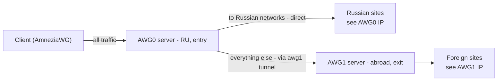

# Two-server cascade: split exit for Russian and foreign traffic

[Русская версия](CASCADE.md) · [Documentation](README.en.md) · [Project site](https://bivlked.github.io/amneziawg-installer/)

This guide turns two `amneziawg-installer` setups into a cascade: a client connects to one server, Russian traffic goes out directly from that server, and everything else exits through a second server abroad. Russian sites then open from a Russian IP without a detour through another country, and foreign traffic uses a clean foreign exit.

> The scheme was proposed by [@glfenix](https://github.com/glfenix) in [discussion #120](https://github.com/bivlked/amneziawg-installer/discussions/120). I tested it on a stand, fixed a few things, and wrote it up. Thanks for the breakdown.

> This is a setup for people who specifically need a split exit. It is more involved than a normal single-box install and is not part of the installer itself: a multi-server cascade is a different scale and does not belong inside one script. Hence this separate step-by-step guide.

<a id="toc"></a>
## Contents

- [What it gives you and when to use it](#what)
- [How it works](#how)
- [What you need](#prereq)
- [Step 1. Install the package on both servers](#step1)
- [Step 2. AWG1 (exit): a client for the link](#step2)
- [Step 3. AWG0 (entry): the tunnel to the exit](#step3)
- [Step 4. The routing script](#step4)
- [Step 5. Autostart after reboot](#step5)
- [Verification](#verify)
- [Updating the list of Russian networks](#update)
- [Troubleshooting](#trouble)
- [Security](#security)
- [Limitations and notes](#limits)

<a id="what"></a>
## What it gives you and when to use it

A normal install sends all client traffic into the tunnel - both foreign and Russian. Russian sites then open from a foreign IP through an extra detour, and some of them refuse foreign addresses entirely.

A cascade splits traffic by destination:

- traffic to Russian networks exits directly from the entry server (Russian sites see a Russian IP and open fast);
- everything else goes through the second server abroad (foreign sites see a foreign IP).

When this helps: you want both fast access to Russian resources from a Russian address and a foreign exit for everything else, all from a single connection on the client.

When you do not need it: if a plain single-server install is enough, or if per-destination routing is simpler to set on the client itself via the `AllowedIPs` list ([split-tunnel in ADVANCED.en.md](ADVANCED.en.md#allowedips-adv)). A cascade is worth it when you want to keep the split on the server and identical for all clients.

<a id="how"></a>
## How it works



- **AWG0 (entry)** - the server clients connect to. It also decides where each flow goes. All cascade logic lives here.
- **AWG1 (exit)** - a normal server abroad. AWG0 connects to it as a client (the `awg1` tunnel).
- The list of Russian networks comes from the [ipdeny](https://www.ipdeny.com/ipblocks/) zone and is loaded into an `ipset`. Traffic to addresses in that list goes direct; the rest is marked and sent into the `awg1` tunnel.

Clients are added on AWG0 as usual (`manage add name`) - no special setup on the client side, the split is entirely on the server.

<a id="prereq"></a>
## What you need

- **Two VPS** on clean Debian 12/13 or Ubuntu 24.04/25.10, with root access.
  - AWG0 (entry) - ideally in or near Russia, so Russian sites open from a nearby address without a detour.
  - AWG1 (exit) - abroad, a normal VPS.
- `amneziawg-installer` installed on both (see below).
- **A real public IP on both VPS** (not behind NAT/CGNAT). The routing script builds the path to the exit through the default gateway, so a server behind provider NAT usually will not work. Quick check: the external address from `curl -s ifconfig.me` matches the address on the interface (`ip -4 addr`) - i.e. the public IP is on the server itself. A red flag is specifically a private address on the interface itself (`10.x`, `100.64.x`) that differs from your external one: that is provider NAT and the cascade entry will be unreachable from outside. A public `/32` with a private gateway (as on Hetzner) is fine - the script handles that case via `onlink` (see [Troubleshooting](#trouble)).
- IPv6 disabled (the installer does this by default). The cascade works over IPv4; with IPv6 on, that traffic would bypass the split.
- On AWG0 also the `curl` and `ipset` packages (a minimal image may lack them).

The two servers must use different subnets. In the examples: AWG0 is `172.16.17.1/24`, AWG1 is `172.16.61.1/24`.

<a id="step1"></a>
## Step 1. Install the package on both servers

Download the installer on each server as described in the [Installation guide](README.en.md#installation) (the English build is `install_amneziawg_en.sh`), then run it with your own subnets:

```bash
# on AWG1 (exit)
bash install_amneziawg_en.sh --yes --disallow-ipv6 --route-all --subnet=172.16.61.1/24

# on AWG0 (entry)
bash install_amneziawg_en.sh --yes --disallow-ipv6 --route-all --subnet=172.16.17.1/24
```

The installer sets up forwarding and NAT itself (`iptables -I FORWARD -i awg0 -j ACCEPT` and `MASQUERADE` on the external interface), and UFW allows return traffic by connection state. So you do not need to edit the `awg0.conf` server config later - the cascade script adds only what is missing.

On AWG0, install the missing packages:

```bash
apt update && apt install -y curl ipset
```

<a id="step2"></a>
## Step 2. AWG1 (exit): a client for the link

On AWG1, create a client that AWG0 will use to connect:

```bash
bash /root/awg/manage_amneziawg.sh add ru_host
```

The script creates `/root/awg/ru_host.conf`. Copy this file to AWG0 by any convenient means (`scp`, clipboard). It looks like this:

```ini
[Interface]
PrivateKey = ...
Address = 172.16.61.4/32
DNS = 1.1.1.1
MTU = 1280
Jc = ... (obfuscation parameters)

[Peer]
PublicKey = ...
Endpoint = AWG1_PUBLIC_IP:39743
AllowedIPs = 0.0.0.0/0
PersistentKeepalive = 33
```

Note the `Endpoint` (AWG1 public IP) - you will need it in the routing script.

<a id="step3"></a>
## Step 3. AWG0 (entry): the tunnel to the exit

On AWG0, save the config from AWG1 as `/etc/amnezia/amneziawg/awg1.conf`, add the line `Table = off` to the `[Interface]` section, and remove the `DNS = ...` line (it is not needed on a server and pulls in an extra dependency). `Table = off` tells `awg-quick` not to add routes automatically - the script will handle routing.

```ini
[Interface]
PrivateKey = ...
Address = 172.16.61.4/32
MTU = 1280
Table = off
Jc = ... (obfuscation parameters)

[Peer]
PublicKey = ...
Endpoint = AWG1_PUBLIC_IP:39743
AllowedIPs = 0.0.0.0/0
PersistentKeepalive = 33
```

Lock down permissions and check that the tunnel comes up:

```bash
chmod 600 /etc/amnezia/amneziawg/awg1.conf
systemctl start awg-quick@awg1
awg show awg1
```

A `latest handshake` line in `awg show awg1` means the link to AWG1 is up. Pinging `172.16.61.1` will not work at this step, and that is fine: the route to it goes through the routing table from the next step, not directly.

<a id="step4"></a>
## Step 4. The routing script

Save `/root/awg/awg-routing.sh` on AWG0. The script is idempotent - you can run it repeatedly (it also refreshes the list of Russian networks).

```bash
#!/bin/bash
# awg-routing.sh - cascade split-routing on the AWG0 (entry) server.
# Client traffic to RU networks goes directly via WAN, everything else - through the awg1 tunnel to AWG1.
# The script is idempotent: it can be run repeatedly (e.g. on a schedule to refresh the RU list).
set -euo pipefail

# ===== settings (adjust to your install) =====
CLIENT_SUBNET="172.16.17.0/24"          # AWG0 client subnet (see Address in /etc/amnezia/amneziawg/awg0.conf)
AWG1_IF="awg1"                           # name of the tunnel interface to the exit server
AWG1_ENDPOINT="CHANGE_ME"               # external IP of AWG1 (Endpoint from awg1.conf, without the port)
TABLE_ID=100                            # routing table number for "to the exit" traffic
FWMARK="0x1"                            # mark for traffic leaving via awg1
RULE_PRIO=10000                        # ip rule priority (uncommon, to avoid collisions)
RU_ZONE_URL="https://www.ipdeny.com/ipblocks/data/aggregated/ru-aggregated.zone"
RU_ZONE_FALLBACK_URL="https://raw.githubusercontent.com/bivlked/amneziawg-installer/v5.20.1/cascade/ru.zone"
AWG_DIR="/root/awg"
# =============================================

RU_ZONE="$AWG_DIR/ru.zone"
trap 'rm -f "$RU_ZONE.tmp"' EXIT         # do not leave the temp list file behind on exit/interrupt

[ "$AWG1_ENDPOINT" != "CHANGE_ME" ] || { echo "ERROR: set AWG1_ENDPOINT (external IP of AWG1)" >&2; exit 1; }

# Derive the egress to AWG1 from the route to the endpoint itself (more robust than parsing the default
# route - works on on-link/point-to-point/multi-homed). On the first run this is the path via WAN.
EP_ROUTE="$(ip -4 route get "$AWG1_ENDPOINT" 2>/dev/null | head -1)"
WAN_IF="$(printf '%s' "$EP_ROUTE" | grep -oP '\bdev \K\S+' || true)"
WAN_GW="$(printf '%s' "$EP_ROUTE" | grep -oP '\bvia \K\S+' || true)"
{ [ -n "$WAN_IF" ] && [ "$WAN_IF" != "$AWG1_IF" ]; } \
    || { echo "ERROR: could not determine the WAN interface to AWG1 (or it points into the tunnel)" >&2; exit 1; }

# IPv6 warning: this scheme is IPv4-only; with IPv6 enabled, that traffic bypasses the split.
if [ "$(cat /proc/sys/net/ipv6/conf/all/disable_ipv6 2>/dev/null || echo 1)" = "0" ] \
   && ip -6 route show default 2>/dev/null | grep -q .; then
    echo "WARN: IPv6 is enabled - IPv6 traffic will bypass the cascade. Disable IPv6 (installer: --disallow-ipv6)." >&2
fi

# 1) Refresh the RU list. Sources in order: ipdeny (current) -> the snapshot bundled in the repository
#    (if ipdeny is unreachable) -> whatever local list is already there. Replace the working file only on
#    a successful, non-empty download, so a failed fetch never wipes the previous list.
fetch_ru_zone() {                                # $1 = URL; downloads into a temp file, 0 on success and non-empty
    curl -fsS --retry 2 -o "$RU_ZONE.tmp" "$1" && [ -s "$RU_ZONE.tmp" ]
}
mkdir -p "$AWG_DIR"
if fetch_ru_zone "$RU_ZONE_URL"; then
    mv -f "$RU_ZONE.tmp" "$RU_ZONE"
elif fetch_ru_zone "$RU_ZONE_FALLBACK_URL"; then
    mv -f "$RU_ZONE.tmp" "$RU_ZONE"
    echo "WARN: ipdeny unreachable - using the RU snapshot bundled in the repository (may lag slightly behind the live list)" >&2
else
    echo "WARN: could not download the list from ipdeny or the repository - keeping the previous local one" >&2
fi
# Do not continue without a list: an empty ipset would send ALL traffic abroad (the split silently breaks).
[ -s "$RU_ZONE" ] || { echo "ERROR: the RU network list is empty and was not found anywhere - aborting to avoid breaking the split" >&2; exit 1; }

# 2) Load RU networks into ipset via a temp set (atomic swap, no empty window).
ipset create ru hash:net -exist
ipset create ru_tmp hash:net -exist
ipset flush ru_tmp
while read -r net; do
    [ -n "$net" ] && ipset add ru_tmp "$net" -exist
done < "$RU_ZONE"
ipset swap ru_tmp ru
ipset destroy ru_tmp

# 3) Table + rule: marked traffic leaves via awg1 (by table number, no rt_tables needed).
ip route replace default dev "$AWG1_IF" table "$TABLE_ID"
ip rule del fwmark "$FWMARK" table "$TABLE_ID" 2>/dev/null || true
ip rule add fwmark "$FWMARK" table "$TABLE_ID" priority "$RULE_PRIO"

# 4) Keep the route to AWG1 itself outside the tunnel (otherwise packets to it loop into awg1). replace = idempotent.
#    If the default route has a gateway - via it; if not (point-to-point/on-link) - straight out the WAN.
if [ -n "$WAN_GW" ]; then
    # On a VPS whose gateway is outside the server's subnet (e.g. Hetzner, a /32 interface) a plain
    # replace fails with "Nexthop has invalid gateway" - then retry with onlink (gateway is on the link).
    ip route replace "$AWG1_ENDPOINT" via "$WAN_GW" dev "$WAN_IF" 2>/dev/null \
        || ip route replace "$AWG1_ENDPOINT" via "$WAN_GW" dev "$WAN_IF" onlink
else
    ip route replace "$AWG1_ENDPOINT" dev "$WAN_IF"
fi

# Forwarding (FORWARD) and NAT for direct RU traffic (-o WAN) are already set by the installer in awg0.conf,
# and UFW passes return traffic by RELATED,ESTABLISHED. So here we add only marking and NAT towards awg1.

# 5) Mark client-subnet traffic entering via awg0: RU networks go direct (RETURN), the rest is marked.
#    -s CLIENT_SUBNET - so other traffic is not touched if you later add another subnet/peer.
#    RETURN must precede MARK; -I ... 1 keeps it first, -C makes the step idempotent.
iptables -t mangle -C PREROUTING -i awg0 -s "$CLIENT_SUBNET" -m set --match-set ru dst -j RETURN 2>/dev/null \
    || iptables -t mangle -I PREROUTING 1 -i awg0 -s "$CLIENT_SUBNET" -m set --match-set ru dst -j RETURN
iptables -t mangle -C PREROUTING -i awg0 -s "$CLIENT_SUBNET" -j MARK --set-mark "$FWMARK" 2>/dev/null \
    || iptables -t mangle -A PREROUTING -i awg0 -s "$CLIENT_SUBNET" -j MARK --set-mark "$FWMARK"

# 6) NAT for client traffic leaving via awg1 (direct RU NAT -o WAN is already provided by the installer).
iptables -t nat -C POSTROUTING -s "$CLIENT_SUBNET" -o "$AWG1_IF" -j MASQUERADE 2>/dev/null \
    || iptables -t nat -A POSTROUTING -s "$CLIENT_SUBNET" -o "$AWG1_IF" -j MASQUERADE

echo "OK: cascade routing applied (WAN=$WAN_IF, gw=${WAN_GW:-on-link}, exit=$AWG1_IF, table=$TABLE_ID)"
```

Set your `CLIENT_SUBNET` and `AWG1_ENDPOINT` at the top, make the file executable, and run it. `CLIENT_SUBNET` is the network (ending in zero), not the server address: if `awg0.conf` has `Address = 172.16.17.1/24`, then `CLIENT_SUBNET="172.16.17.0/24"`. `AWG1_ENDPOINT` is the AWG1 public IP (from `Endpoint` in `awg1.conf`, without the port):

```bash
chmod +x /root/awg/awg-routing.sh
bash /root/awg/awg-routing.sh
```

What the script does, step by step:

1. Downloads the list of Russian networks into a temp file and swaps the working file only on a successful download. Sources are tried in order: ipdeny (the current list), then the snapshot bundled in this repository (`cascade/ru.zone`) if ipdeny is unreachable, then whatever local list is already there. A failed download will not wipe the already-loaded list.
2. Loads the networks into `ipset` through a temp set and atomically swaps the working one (`ipset swap`) - with no window where the set is empty.
3. Creates a routing table for marked traffic and an `ip rule` by mark. The table is addressed by number, so no `rt_tables` file is needed.
4. Lays a route to AWG1 itself outside the tunnel, otherwise packets to it would loop.
5. Marks traffic: to Russian networks - direct (`RETURN`), the rest - marked to leave via `awg1`.
6. Adds NAT for traffic leaving via `awg1`.

<a id="step5"></a>
## Step 5. Autostart after reboot

The `awg1` tunnel (`awg-quick@awg1`) and the `awg0` server are started by the installer itself. What is left is to run the routing script after both tunnels. A single oneshot unit tied to both tunnels does this - it starts strictly after them, so no separate ordering between `awg0` and `awg1` is needed.

Create `/etc/systemd/system/awg-routing.service`:

```ini
[Unit]
Description=Cascade split-routing for AWG0
After=awg-quick@awg0.service awg-quick@awg1.service network-online.target
Requires=awg-quick@awg0.service awg-quick@awg1.service
Wants=network-online.target

[Service]
Type=oneshot
RemainAfterExit=yes
ExecStart=/root/awg/awg-routing.sh

[Install]
WantedBy=multi-user.target
```

Enable autostart (`awg-quick@awg0` is already enabled by the installer):

```bash
systemctl daemon-reload
systemctl enable awg-quick@awg1 awg-routing
```

`Requires` here is hard: if `awg1` fails to come up, the routing script will not run (clients still connect to `awg0`, but without the split exit - all traffic goes direct). After a reboot the tunnels and routing come up on their own, nothing needs to be touched by hand.

<a id="verify"></a>
## Verification

On AWG0, confirm the rule, table, and list are in place:

```bash
ip rule show | grep fwmark
# 10000:  from all fwmark 0x1 lookup 100

ip route show table 100
# default dev awg1 scope link

ipset list ru | grep "Number of entries"
# Number of entries: 8600+   (number of Russian networks)

# the Russian address really is in the set
ipset test ru 77.88.55.242
# Warning: 77.88.55.242 is in set ru.
```

Check that traffic splits correctly:

```bash
# to a Russian address (Yandex) - direct via the external interface (the "via GATEWAY" part depends on the host)
ip route get 77.88.55.242
# 77.88.55.242 via GATEWAY dev eth0 ...

# to a foreign address with the mark - via the awg1 tunnel
ip route get 1.1.1.1 mark 0x1
# 1.1.1.1 dev awg1 table 100 ...
```

The clearest check uses the counters. Zero them, then from a client connected to AWG0 generate both kinds of traffic and compare:

```bash
# on AWG0: zero the counters
iptables -t mangle -Z PREROUTING

# on the client: a foreign site (via the AWG1 exit) and a Russian one (direct)
curl https://ifconfig.me          # shows AWG1_PUBLIC_IP (the exit server)
ping -c3 77.88.55.242             # a Russian address (Yandex)

# on AWG0: the counters show the split itself
iptables -t mangle -L PREROUTING -n -v
# RETURN ... match-set ru dst    <- packets to RU went up (direct)
# MARK   ... MARK set 0x1        <- the rest went up (via awg1)
```

<a id="update"></a>
## Updating the list of Russian networks

The list of Russian networks changes over time. The script re-reads it on every run, so it is enough to restart it periodically. For example, weekly via cron:

```bash
echo '0 5 * * 1 root systemctl restart awg-routing' > /etc/cron.d/awg-routing-refresh
```

<a id="trouble"></a>
## Troubleshooting

- **All sites, including Russian ones, go through the foreign exit.** Check that the list loaded: `ipset list ru | grep "Number of entries"` should be non-zero. If `www.ipdeny.com` is blocked on your provider, the script falls back to the snapshot bundled in the repository (`cascade/ru.zone`) - its output will mention the repository. Zero entries means no source worked: check access to `www.ipdeny.com` and `raw.githubusercontent.com`, then run the script again.
- **The tunnel to AWG1 does not come up** (`awg show awg1` has no `latest handshake`). Check the `Endpoint` in `awg1.conf`, that the AWG1 port is open, and that the service on AWG1 is running (`systemctl status awg-quick@awg0` on AWG1).
- **The cascade does not work after a reboot.** Check autostart: `systemctl is-enabled awg-quick@awg1 awg-routing` (both `enabled`) and that the `awg-routing.service` unit ran after the reboot (`systemctl status awg-routing`).
- **A specific Russian site still opens through the foreign exit.** It is most likely not hosted on a Russian IP (common for sites behind Cloudflare and foreign CDNs). The split is by destination IP, so such a site goes into the tunnel - this is expected.
- **YouTube buffers and stalls, Google Play won't download apps, and Google services serve Russian results - even though your cascade exit is abroad.** Some of Google's and YouTube's nodes - their caches and CDN - sit on Russian IPs and land in the RU list. The split is by destination address, so a connection to such a node goes directly via the entry, and Google sees a Russian address. Changing DNS does not reliably help here: Google's networks are largely shared and announced from many places, and some addresses still count as Russian. To make Google and YouTube always go through the foreign exit you need an up-to-date list of their networks (not just AS15169 - GGC cache nodes often live in ISP networks): mark them before the RETURN rule, or drop them from the ru set - then they leave via the exit instead of going direct. The downside: all of Google then always goes through the exit.
- **Upload is much slower than download.** If download is fine but upload drops to almost nothing, the cause is usually not MTU (it caps segments in both directions, so download would suffer too) and not the CPU (it would slow both directions at once). A healthy download proves that the entry server AWG0 can send to the client at full speed; the bottleneck is the AWG0 -> AWG1 leg that carries the upload outward (download does not use it). Candidates: the entry host shaping outbound traffic towards AWG1, poor peering to the exit network, or an inbound limit on AWG1 itself. Measure that leg directly: run `iperf3 -s` on AWG1, and from AWG0 run `iperf3 -c <AWG1 IP>` (upload AWG0 -> AWG1) and `iperf3 -c <AWG1 IP> -R` (download). A low first number with a normal second confirms that the AWG0 -> AWG1 leg is the choke, not the servers themselves.
- **The `awg-routing.sh` script fails with `Error: Nexthop has invalid gateway`.** It means the default gateway sits outside the server's subnet: the interface has a `/32` address and the gateway is somewhere off it - the kernel does not treat such a gateway as on-link and rejects the route. The current version of the script already handles this: on that error it retries adding the route with the `onlink` flag, so on a VPS like Hetzner (a real public IP on a `/32` and a private gateway such as `172.31.1.1`) the cascade just works - update `awg-routing.sh` from the guide if your copy is old. But first make sure the server really has a public IP: the address from `ip -4 addr` should match `curl -s ifconfig.me`. If the interface has a private address (`10.x`, `100.64.x` CGNAT) that differs from your external IP, the server is behind provider NAT - then the cascade entry is unreachable from outside and you need a real public IP on both servers (see [What you need](#prereq)).

<a id="security"></a>
## Security

- Do not disable UFW entirely (`ufw disable`) for speed - the firewall has a negligible effect on throughput; the heavy load comes from encryption and forwarding. Keep a minimum: forwarding and the needed ports, everything else closed.
- The entry server AWG0 sees all client traffic before it leaves through `awg1` - this is a trust point, keep access to it under control.

<a id="limits"></a>
## Limitations and notes

- The cascade is not part of the installer and is not managed by it - it is a separate manual setup on top of two normal installs.
- The scheme works over IPv4. Keep IPv6 disabled (the installer does so by default), otherwise IPv6 traffic would bypass the split.
- No separate MTU tuning is needed: the double encapsulation fits within the standard size, and large transfers go through without loss.
- The client's DNS queries go through the foreign exit - this does not affect operation and creates no leak.

---

The scheme was proposed by [@glfenix](https://github.com/glfenix) in [#120](https://github.com/bivlked/amneziawg-installer/discussions/120). Questions and improvements - there, or in [Issues](https://github.com/bivlked/amneziawg-installer/issues).
