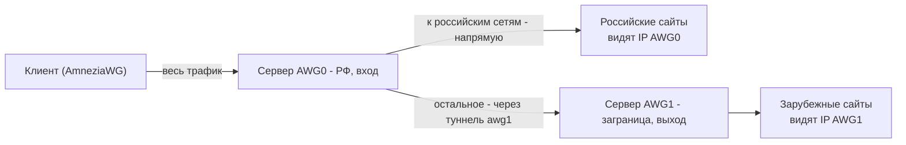

# Каскад из двух серверов: раздельный выход для российского и зарубежного трафика

[English version](CASCADE.en.md) · [Документация](README.md) · [Сайт проекта](https://bivlked.github.io/amneziawg-installer/ru/)

Эта инструкция собирает из двух установок `amneziawg-installer` каскад: клиент подключается к одному серверу, российский трафик уходит в интернет напрямую с этого сервера, а весь остальной - через второй сервер за границей. Так российские сайты открываются с российского IP и без лишнего крюка через заграницу, а зарубежные идут через чистый зарубежный выход.

> Основу схемы предложил [@glfenix](https://github.com/glfenix) в [обсуждении #120](https://github.com/bivlked/amneziawg-installer/discussions/120). Я её проверил на стенде, поправил пару мест и оформил в инструкцию. Спасибо за разбор.

> Это сценарий для тех, кому нужен раздельный выход. Он сложнее обычной установки на одну коробку и в сам установщик не входит: каскад из нескольких серверов - другой масштаб, в одном скрипте его держать неправильно. Поэтому здесь - отдельная пошаговая инструкция.

<a id="toc"></a>
## Содержание

- [Что это даёт и когда нужно](#what)
- [Как это работает](#how)
- [Что понадобится](#prereq)
- [Шаг 1. Установка пакета на оба сервера](#step1)
- [Шаг 2. Сервер AWG1 (выход): клиент для связи](#step2)
- [Шаг 3. Сервер AWG0 (вход): туннель к выходу](#step3)
- [Шаг 4. Скрипт маршрутизации](#step4)
- [Шаг 5. Автозапуск после перезагрузки](#step5)
- [Проверка](#verify)
- [Обновление списка российских сетей](#update)
- [Диагностика](#trouble)
- [Безопасность](#security)
- [Ограничения и нюансы](#limits)

<a id="what"></a>
## Что это даёт и когда нужно

Обычная установка отправляет в туннель весь трафик клиента - и зарубежный, и российский. Российские сайты в этом случае открываются с зарубежного IP и через лишний крюк, а часть из них вообще не пускает иностранные адреса.

Каскад делит трафик по месту назначения:

- трафик к российским сетям уходит в интернет напрямую с сервера-входа (российские сайты видят российский IP и открываются быстро);
- весь остальной трафик идёт через второй сервер за границей (зарубежные сайты видят зарубежный IP).

Когда это полезно: нужен одновременно быстрый доступ к российским ресурсам с российского адреса и зарубежный выход для всего прочего, причём с одного подключения на клиенте.

Когда не нужно: если хватает обычной установки на один сервер, или раздельную маршрутизацию проще задать на самом клиенте через список `AllowedIPs` ([split-tunnel в ADVANCED.md](ADVANCED.md#allowedips-adv)). Каскад оправдан, когда деление трафика хочется держать на сервере и одинаково для всех клиентов.

<a id="how"></a>
## Как это работает



- **AWG0 (вход)** - сервер, к которому подключаются клиенты. Он же принимает решение, куда направить трафик. Здесь живёт вся логика каскада.
- **AWG1 (выход)** - обычный сервер за границей. AWG0 подключается к нему как клиент (туннель `awg1`).
- Список российских сетей берётся из зоны [ipdeny](https://www.ipdeny.com/ipblocks/) и загружается в `ipset`. Трафик к адресам из этого списка идёт напрямую, остальной помечается меткой и уходит в туннель `awg1`.

Клиенты добавляются на AWG0 как обычно (`manage add имя`) - никакой особой настройки на стороне клиента не нужно, деление трафика целиком на сервере.

<a id="prereq"></a>
## Что понадобится

- **Два VPS** на чистом Debian 12/13 или Ubuntu 24.04/25.10, root-доступ.
  - AWG0 (вход) - лучше в России или рядом, чтобы российские сайты открывались с близкого адреса и без крюка.
  - AWG1 (выход) - за границей, обычный VPS.
- На обоих установлен `amneziawg-installer` (как - ниже).
- **Реальный публичный IP на обоих VPS** (не за NAT/CGNAT). Скрипт маршрутизации строит путь к выходу через шлюз по умолчанию, поэтому сервер за провайдерским NAT обычно не подойдёт. Быстрая проверка: внешний адрес из `curl -s ifconfig.me` совпадает с адресом на интерфейсе (`ip -4 addr`) - значит публичный IP именно на сервере. Тревожный признак - именно приватный адрес на самом интерфейсе (`10.x`, `100.64.x`), не равный внешнему: это провайдерский NAT, вход каскада будет недоступен снаружи. А вот публичный `/32` с приватным шлюзом (как у Hetzner) - нормально: скрипт такой случай обрабатывает через `onlink` (см. [Диагностику](#trouble)).
- IPv6 выключен (так ставит установщик по умолчанию). Каскад работает по IPv4; при включённом IPv6 трафик пойдёт мимо деления.
- На AWG0 дополнительно пакеты `curl` и `ipset` (на минимальном образе их может не быть).

Подсети двух серверов должны различаться. В примерах: AWG0 - `172.16.17.1/24`, AWG1 - `172.16.61.1/24`.

<a id="step1"></a>
## Шаг 1. Установка пакета на оба сервера

Поставьте `amneziawg-installer` на каждый сервер по [основной инструкции](README.md#quickstart) и запустите неинтерактивно с нужными подсетями:

```bash
# на AWG1 (выход)
bash install_amneziawg.sh --yes --disallow-ipv6 --route-all --subnet=172.16.61.1/24

# на AWG0 (вход)
bash install_amneziawg.sh --yes --disallow-ipv6 --route-all --subnet=172.16.17.1/24
```

Установщик сам настраивает пересылку и NAT (`iptables -I FORWARD -i awg0 -j ACCEPT` и `MASQUERADE` на внешний интерфейс), а UFW пропускает обратный трафик по состоянию соединения. Поэтому серверный конфиг `awg0.conf` дальше править не нужно - каскадный скрипт добавит только то, чего нет.

На AWG0 доставьте недостающие пакеты:

```bash
apt update && apt install -y curl ipset
```

<a id="step2"></a>
## Шаг 2. Сервер AWG1 (выход): клиент для связи

На AWG1 создайте клиента, через которого к нему будет подключаться AWG0:

```bash
bash /root/awg/manage_amneziawg.sh add ru_host
```

Скрипт создаст `/root/awg/ru_host.conf`. Скопируйте этот файл на AWG0 любым удобным способом (`scp`, буфер обмена). Внутри он выглядит так:

```ini
[Interface]
PrivateKey = ...
Address = 172.16.61.4/32
DNS = 1.1.1.1
MTU = 1280
Jc = ... (параметры обфускации)

[Peer]
PublicKey = ...
Endpoint = ВНЕШНИЙ_IP_AWG1:39743
AllowedIPs = 0.0.0.0/0
PersistentKeepalive = 33
```

Запомните `Endpoint` (внешний IP AWG1) - он понадобится в скрипте маршрутизации.

<a id="step3"></a>
## Шаг 3. Сервер AWG0 (вход): туннель к выходу

На AWG0 положите конфиг от AWG1 как `/etc/amnezia/amneziawg/awg1.conf`, добавьте в секцию `[Interface]` строку `Table = off` и уберите строку `DNS = ...` (на сервере она не нужна и тянет лишнюю зависимость). `Table = off` говорит `awg-quick` не добавлять маршруты автоматически - маршрутизацией займётся наш скрипт.

```ini
[Interface]
PrivateKey = ...
Address = 172.16.61.4/32
MTU = 1280
Table = off
Jc = ... (параметры обфускации)

[Peer]
PublicKey = ...
Endpoint = ВНЕШНИЙ_IP_AWG1:39743
AllowedIPs = 0.0.0.0/0
PersistentKeepalive = 33
```

Закройте права и проверьте, что туннель поднимается:

```bash
chmod 600 /etc/amnezia/amneziawg/awg1.conf
systemctl start awg-quick@awg1
awg show awg1
```

В выводе `awg show awg1` должна появиться строка `latest handshake` - значит связь с AWG1 есть. Пинг адреса `172.16.61.1` на этом шаге не пройдёт, и это нормально: маршрут к нему пойдёт через нашу таблицу маршрутизации из следующего шага, а не напрямую.

<a id="step4"></a>
## Шаг 4. Скрипт маршрутизации

Сохраните на AWG0 файл `/root/awg/awg-routing.sh`. Скрипт идемпотентный - его можно запускать повторно (он же обновляет список российских сетей).

```bash
#!/bin/bash
# awg-routing.sh - каскадный сплит-роутинг на сервере AWG0 (вход).
# RU-трафик клиентов идёт напрямую через WAN, остальное - через туннель awg1 на сервер-выход AWG1.
# Скрипт идемпотентен: его можно запускать повторно (в т.ч. по расписанию для обновления RU-сетей).
set -euo pipefail

# ===== параметры (поправь под свою установку) =====
CLIENT_SUBNET="172.16.17.0/24"          # подсеть клиентов AWG0 (см. Address в /etc/amnezia/amneziawg/awg0.conf)
AWG1_IF="awg1"                           # имя интерфейса туннеля к серверу-выходу
AWG1_ENDPOINT="CHANGE_ME"               # внешний IP сервера AWG1 (Endpoint из awg1.conf, без порта)
TABLE_ID=100                            # номер таблицы маршрутизации для трафика "на выход"
FWMARK="0x1"                            # метка для трафика, уходящего через awg1
RULE_PRIO=10000                        # приоритет правила ip rule (нестандартный, чтобы не конфликтовать)
RU_ZONE_URL="https://www.ipdeny.com/ipblocks/data/aggregated/ru-aggregated.zone"
RU_ZONE_FALLBACK_URL="https://raw.githubusercontent.com/bivlked/amneziawg-installer/v5.19.0/cascade/ru.zone"
AWG_DIR="/root/awg"
# ==================================================

RU_ZONE="$AWG_DIR/ru.zone"
trap 'rm -f "$RU_ZONE.tmp"' EXIT         # не оставлять временный файл списка при выходе/прерывании

[ "$AWG1_ENDPOINT" != "CHANGE_ME" ] || { echo "ERROR: впиши AWG1_ENDPOINT (внешний IP сервера AWG1)" >&2; exit 1; }

# Определяем выход к AWG1 по самому маршруту до endpoint (надёжнее парсинга default - работает и на
# on-link/point-to-point/multi-homed). На первом запуске это путь через WAN (туннель ещё не вмешивается).
EP_ROUTE="$(ip -4 route get "$AWG1_ENDPOINT" 2>/dev/null | head -1)"
WAN_IF="$(printf '%s' "$EP_ROUTE" | grep -oP '\bdev \K\S+' || true)"
WAN_GW="$(printf '%s' "$EP_ROUTE" | grep -oP '\bvia \K\S+' || true)"
{ [ -n "$WAN_IF" ] && [ "$WAN_IF" != "$AWG1_IF" ]; } \
    || { echo "ERROR: не удалось определить WAN-интерфейс к AWG1 (или он указывает в туннель)" >&2; exit 1; }

# Предупреждение про IPv6: схема только для IPv4, при включённом IPv6 он пойдёт мимо деления.
if [ "$(cat /proc/sys/net/ipv6/conf/all/disable_ipv6 2>/dev/null || echo 1)" = "0" ] \
   && ip -6 route show default 2>/dev/null | grep -q .; then
    echo "WARN: на сервере включён IPv6 - IPv6-трафик пойдёт мимо каскада. Отключи IPv6 (установщик: --disallow-ipv6)." >&2
fi

# 1) Обновить список RU-сетей. Источники по порядку: ipdeny (актуальный) -> снимок в репозитории
#    (если ipdeny недоступен) -> уже лежащий локальный список. Рабочий файл заменяем только при
#    успешной непустой загрузке, поэтому сорванная закачка не обнулит прежний список.
fetch_ru_zone() {                                # $1 = URL; качает во временный файл, 0 при успехе и непустом файле
    curl -fsS --retry 2 -o "$RU_ZONE.tmp" "$1" && [ -s "$RU_ZONE.tmp" ]
}
mkdir -p "$AWG_DIR"
if fetch_ru_zone "$RU_ZONE_URL"; then
    mv -f "$RU_ZONE.tmp" "$RU_ZONE"
elif fetch_ru_zone "$RU_ZONE_FALLBACK_URL"; then
    mv -f "$RU_ZONE.tmp" "$RU_ZONE"
    echo "WARN: ipdeny недоступен - взял снимок RU-сетей из репозитория (может немного отставать от актуального)" >&2
else
    echo "WARN: не удалось скачать список ни с ipdeny, ни из репозитория - использую прежний локальный" >&2
fi
# Без списка не продолжаем: пустой ipset отправит ВЕСЬ трафик за границу (деление молча сломается).
[ -s "$RU_ZONE" ] || { echo "ERROR: список RU-сетей пуст и нигде не найден - прерываюсь, чтобы не сломать деление" >&2; exit 1; }

# 2) Загрузить RU-сети в ipset через временный сет (атомарная замена, без "пустого окна").
ipset create ru hash:net -exist
ipset create ru_tmp hash:net -exist
ipset flush ru_tmp
while read -r net; do
    [ -n "$net" ] && ipset add ru_tmp "$net" -exist
done < "$RU_ZONE"
ipset swap ru_tmp ru
ipset destroy ru_tmp

# 3) Таблица + правило: помеченный трафик уходит на выход через awg1 (по номеру таблицы, rt_tables не нужен).
ip route replace default dev "$AWG1_IF" table "$TABLE_ID"
ip rule del fwmark "$FWMARK" table "$TABLE_ID" 2>/dev/null || true
ip rule add fwmark "$FWMARK" table "$TABLE_ID" priority "$RULE_PRIO"

# 4) Маршрут к самому AWG1 держим вне туннеля (иначе пакеты к нему закольцуются в awg1). replace = идемпотентно.
if [ -n "$WAN_GW" ]; then
    # На VPS со шлюзом вне подсети сервера (напр. Hetzner, интерфейс /32) обычный replace падает
    # с "Nexthop has invalid gateway" - тогда повторяем с onlink (шлюз доступен прямо на интерфейсе).
    ip route replace "$AWG1_ENDPOINT" via "$WAN_GW" dev "$WAN_IF" 2>/dev/null \
        || ip route replace "$AWG1_ENDPOINT" via "$WAN_GW" dev "$WAN_IF" onlink
else
    ip route replace "$AWG1_ENDPOINT" dev "$WAN_IF"
fi

# Пересылку (FORWARD) и NAT прямого RU-трафика (-o WAN) уже настроил установщик в awg0.conf,
# обратный трафик пропускает UFW по RELATED,ESTABLISHED. Здесь добавляем только маркировку и NAT на awg1.

# 5) Маркировка трафика клиентской подсети, входящего через awg0: RU-сети напрямую (RETURN), остальное метим.
#    -s CLIENT_SUBNET - чтобы не задеть другой трафик, если позже добавишь ещё подсеть/пир.
#    RETURN должен стоять перед MARK; -I ... 1 держит его первым, -C делает шаг идемпотентным.
iptables -t mangle -C PREROUTING -i awg0 -s "$CLIENT_SUBNET" -m set --match-set ru dst -j RETURN 2>/dev/null \
    || iptables -t mangle -I PREROUTING 1 -i awg0 -s "$CLIENT_SUBNET" -m set --match-set ru dst -j RETURN
iptables -t mangle -C PREROUTING -i awg0 -s "$CLIENT_SUBNET" -j MARK --set-mark "$FWMARK" 2>/dev/null \
    || iptables -t mangle -A PREROUTING -i awg0 -s "$CLIENT_SUBNET" -j MARK --set-mark "$FWMARK"

# 6) NAT для трафика клиентов, уходящего на выход через awg1 (для прямого RU NAT -o WAN уже есть от установщика).
iptables -t nat -C POSTROUTING -s "$CLIENT_SUBNET" -o "$AWG1_IF" -j MASQUERADE 2>/dev/null \
    || iptables -t nat -A POSTROUTING -s "$CLIENT_SUBNET" -o "$AWG1_IF" -j MASQUERADE

echo "OK: каскадный роутинг применён (WAN=$WAN_IF, gw=${WAN_GW:-on-link}, выход=$AWG1_IF, table=$TABLE_ID)"
```

Впишите в начале свои `CLIENT_SUBNET` и `AWG1_ENDPOINT`, сделайте файл исполняемым и запустите. `CLIENT_SUBNET` - это сеть (с нулём на конце), а не адрес сервера: если в `awg0.conf` стоит `Address = 172.16.17.1/24`, то `CLIENT_SUBNET="172.16.17.0/24"`. `AWG1_ENDPOINT` - внешний IP сервера AWG1 (из `Endpoint` в `awg1.conf`, без порта).

```bash
chmod +x /root/awg/awg-routing.sh
bash /root/awg/awg-routing.sh
```

Что делает скрипт по шагам:

1. Скачивает список российских сетей во временный файл и подменяет рабочий только при успешной загрузке. Источники по очереди: ipdeny (актуальный список), при его недоступности - снимок из этого репозитория (`cascade/ru.zone`), затем уже лежащий локальный список. Сорванная закачка не обнулит уже загруженный список.
2. Загружает сети в `ipset` через временный набор и атомарно подменяет рабочий (`ipset swap`) - без окна, когда набор пустой.
3. Создаёт таблицу маршрутизации для помеченного трафика и правило `ip rule` по метке. Таблица задаётся номером, файл `rt_tables` не нужен.
4. Прокладывает маршрут к самому AWG1 вне туннеля, иначе пакеты к нему закольцуются.
5. Метит трафик: к российским сетям - напрямую (`RETURN`), остальное - меткой для ухода в `awg1`.
6. Добавляет NAT для трафика, уходящего через `awg1`.

<a id="step5"></a>
## Шаг 5. Автозапуск после перезагрузки

Сам туннель `awg1` (сервис `awg-quick@awg1`) и сервер `awg0` установщик умеет поднимать сам. Осталось, чтобы после обоих туннелей отрабатывал скрипт маршрутизации. Это делает один oneshot-юнит, который привязан к обоим туннелям и поэтому стартует строго после них - отдельный порядок между `awg0` и `awg1` задавать не нужно.

Создайте `/etc/systemd/system/awg-routing.service`:

```ini
[Unit]
Description=Каскадный сплит-роутинг для AWG0
After=awg-quick@awg0.service awg-quick@awg1.service network-online.target
Requires=awg-quick@awg0.service awg-quick@awg1.service
Wants=network-online.target

[Service]
Type=oneshot
RemainAfterExit=yes
ExecStart=/root/awg/awg-routing.sh

[Install]
WantedBy=multi-user.target
```

Включите автозапуск (`awg-quick@awg0` установщик уже включил):

```bash
systemctl daemon-reload
systemctl enable awg-quick@awg1 awg-routing
```

`Requires` здесь жёсткий: если `awg1` не поднимется, скрипт маршрутизации не запустится (клиенты при этом всё равно подключатся к `awg0`, но без раздельного выхода - весь трафик пойдёт напрямую). Теперь после перезагрузки туннели и маршрутизация поднимаются сами, руками ничего трогать не нужно.

<a id="verify"></a>
## Проверка

На AWG0 убедитесь, что правило, таблица и список на месте:

```bash
ip rule show | grep fwmark
# 10000:  from all fwmark 0x1 lookup 100

ip route show table 100
# default dev awg1 scope link

ipset list ru | grep "Number of entries"
# Number of entries: 8600+   (число российских сетей)

# российский адрес действительно в списке
ipset test ru 77.88.55.242
# Warning: 77.88.55.242 is in set ru.
```

Проверьте, что трафик расходится правильно:

```bash
# к российскому адресу (Яндекс) - напрямую через внешний интерфейс (часть "via ШЛЮЗ" зависит от хостера)
ip route get 77.88.55.242
# 77.88.55.242 via ШЛЮЗ dev eth0 ...

# к зарубежному адресу с меткой - через туннель awg1
ip route get 1.1.1.1 mark 0x1
# 1.1.1.1 dev awg1 table 100 ...
```

Самая наглядная проверка - со счётчиками. Обнулите их, затем с клиента, подключённого к AWG0, создайте оба вида трафика и сравните:

```bash
# на AWG0: обнулить счётчики
iptables -t mangle -Z PREROUTING

# на клиенте: зарубежный сайт (через выход AWG1) и российский (напрямую)
curl https://ifconfig.me          # покажет ВНЕШНИЙ_IP_AWG1 (сервер-выход)
ping -c3 77.88.55.242             # российский адрес (Яндекс)

# на AWG0: счётчики покажут само деление
iptables -t mangle -L PREROUTING -n -v
# RETURN ... match-set ru dst    <- пакеты к РФ выросли (напрямую)
# MARK   ... MARK set 0x1        <- остальные выросли (через awg1)
```

<a id="update"></a>
## Обновление списка российских сетей

Список российских сетей со временем меняется. Скрипт перечитывает его при каждом запуске, поэтому достаточно периодически его перезапускать. Например, раз в неделю через cron:

```bash
echo '0 5 * * 1 root systemctl restart awg-routing' > /etc/cron.d/awg-routing-refresh
```

<a id="trouble"></a>
## Диагностика

- **Все сайты, включая российские, идут через заграницу.** Проверьте, что список загрузился: `ipset list ru | grep "Number of entries"` должно быть не ноль. Если `www.ipdeny.com` заблокирован у вашего провайдера, скрипт сам возьмёт снимок сетей из репозитория (`cascade/ru.zone`) - в его выводе будет строка про репозиторий. Ноль записей значит, что не сработал ни один источник: проверьте доступ к `www.ipdeny.com` и к `raw.githubusercontent.com` и запустите скрипт ещё раз.
- **Туннель к AWG1 не поднимается** (`awg show awg1` без `latest handshake`). Проверьте `Endpoint` в `awg1.conf`, что порт AWG1 открыт, и что сам сервис на AWG1 работает (`systemctl status awg-quick@awg0` на AWG1).
- **После перезагрузки каскад не работает.** Проверьте автозапуск: `systemctl is-enabled awg-quick@awg1 awg-routing` (оба `enabled`) и что юнит `awg-routing.service` отработал после перезагрузки (`systemctl status awg-routing`).
- **Конкретный российский сайт всё равно открывается через заграницу.** Скорее всего он размещён не на российском IP (часто бывает с сайтами за Cloudflare и зарубежными CDN). Деление идёт по IP назначения, поэтому такой сайт уходит в туннель - это ожидаемо.
- **YouTube тормозит и буферизует, Google Play не загружает приложения, а сервисы Google отдают российскую выдачу - хотя выход у каскада зарубежный.** Часть узлов Google и YouTube - их кэши и CDN - стоит на российских IP и попадает в список RU. Деление идёт по адресу назначения, поэтому соединение с таким узлом уходит напрямую через вход, и Google видит российский адрес. Подмена DNS тут надёжно не лечит: сети Google во многом общие и анонсируются из разных мест, часть адресов всё равно остаётся российской. Чтобы Google и YouTube всегда шли через зарубежный выход, нужен актуальный список их сетей (не только AS15169 - кэш-узлы GGC часто лежат в сетях провайдеров): пометьте их ДО правила RETURN или вовсе исключите из набора ru - тогда они уйдут через выход, а не напрямую. Минус: весь Google при этом идёт через выход всегда.
- **Отдача (upload) намного ниже приёма (download).** Если приём идёт нормально, а отдача проседает почти в ноль, дело обычно не в MTU (он режет сегменты в обе стороны, тогда страдал бы и приём) и не в процессоре (он бы просадил обе стороны разом). Живой приём доказывает, что вход AWG0 отдаёт клиенту на скорости; узкое место - именно плечо AWG0 -> AWG1, по которому уходит отдача наружу (приём его не использует). Кандидаты: шейпинг исходящего у хостера входного сервера в сторону AWG1, кривой пиринг до сети выхода, либо входной лимит на самом AWG1. Замерьте это плечо напрямую: на AWG1 запустите `iperf3 -s`, с AWG0 - `iperf3 -c <IP AWG1>` (отдача AWG0 -> AWG1) и `iperf3 -c <IP AWG1> -R` (приём). Низкая первая цифра при нормальной второй подтверждает, что душит участок AWG0 -> AWG1, а не сами серверы.
- **Скрипт `awg-routing.sh` падает с `Error: Nexthop has invalid gateway`.** Значит шлюз по умолчанию лежит вне подсети сервера: на интерфейсе `/32`-адрес, а шлюз где-то снаружи - ядро не считает такой шлюз on-link и отвергает маршрут. Свежая версия скрипта это уже обрабатывает: при такой ошибке повторяет добавление маршрута с флагом `onlink`, поэтому на VPS вроде Hetzner (у них реальный публичный IP на `/32` и приватный шлюз типа `172.31.1.1`) каскад просто работает - обновите `awg-routing.sh` из гайда, если копия старая. Но сначала убедитесь, что у сервера действительно есть публичный IP: адрес из `ip -4 addr` должен совпадать с `curl -s ifconfig.me`. Если на интерфейсе приватный адрес (`10.x`, `100.64.x` CGNAT), не равный вашему внешнему IP, сервер за провайдерским NAT - тогда вход каскада снаружи недоступен, и нужен реальный публичный IP на обоих серверах (см. [Что понадобится](#prereq)).

<a id="security"></a>
## Безопасность

- Не выключайте UFW целиком (`ufw disable`) ради скорости - на пропускную способность фаервол практически не влияет, основную нагрузку дают шифрование и пересылка. Оставьте минимум: пересылку и нужные порты, остальное закрыто.
- Сервер-вход AWG0 видит весь трафик клиентов до ухода в `awg1` - это точка доверия, держите к нему доступ под контролем.

<a id="limits"></a>
## Ограничения и нюансы

- Каскад не входит в установщик и не управляется им - это отдельная ручная настройка поверх двух обычных установок.
- Схема работает по IPv4. Держите IPv6 выключенным (установщик так и ставит по умолчанию), иначе IPv6-трафик пойдёт мимо деления.
- Отдельно настраивать MTU не нужно: двойная инкапсуляция укладывается в стандартный размер, большие передачи проходят без потерь.
- DNS-запросы клиента идут через зарубежный выход - это не влияет на работу и не создаёт утечки.

---

Схему предложил [@glfenix](https://github.com/glfenix) в [#120](https://github.com/bivlked/amneziawg-installer/discussions/120). Вопросы и улучшения - туда же или в [Issues](https://github.com/bivlked/amneziawg-installer/issues).
